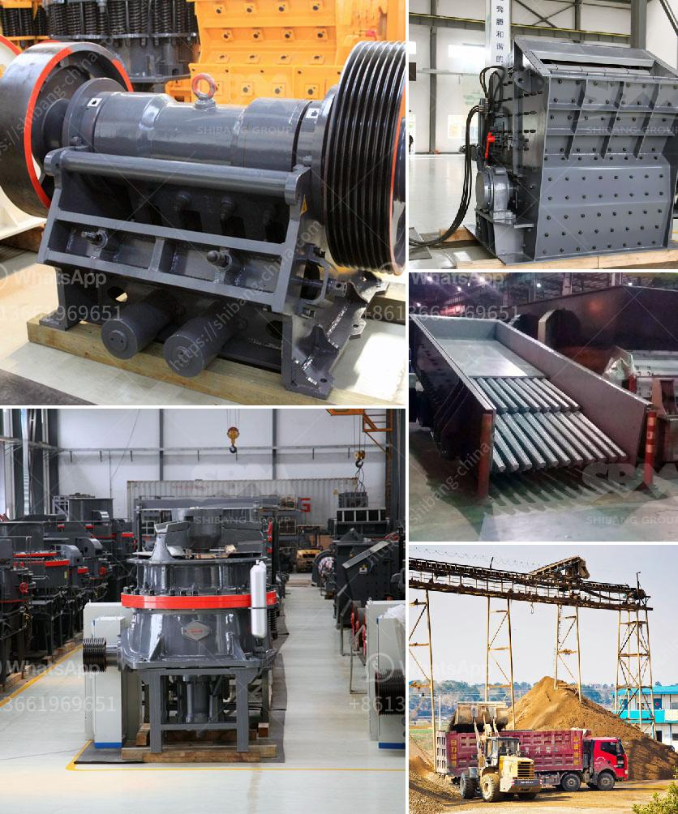

<h3>coal wash plants for sale in malaysia</h3>
As the world increasingly focuses on sustainable practices and clean energy alternatives, the demand for coal production has evolved to include proper treatment and beneficiation processes. Coal wash plants, also known as coal preparation plants (CPP), are pivotal in ensuring the coal produced meets the highest quality standards while minimizing environmental impacts. In Malaysia, the growing demand for affordable and reliable energy sources has led to the emergence of coal wash plants for sale, facilitating the nation's transition to cleaner coal utilization.

Coal wash plants play a crucial role in the coal mining industry by transforming raw coal into high-quality fuel while minimizing impurities. Through the coal washing process, contaminants such as sulfur, ash, and rock are removed, reducing greenhouse gas emissions and air pollution associated with burning low-quality coal. Additionally, the washing process leads to a higher heating value, which results in improved combustion efficiency and reduced coal consumption for power generation.

Coal wash plants employ a range of technologies to ensure coal quality improvement. Dense medium, cyclones, jigs, and flotation cells are among the most commonly used equipment in coal wash plants. Dense medium separators use a suspension medium, usually a mixture of magnetite and water, to separate coal from impurities. Jigs and flotation cells rely on differences in the density and surface properties of coal and impurities, respectively.

Malaysia, with its abundant coal resources, is on a quest to enhance its coal utilization efficiency and reduce its reliance on imports. The establishment of coal wash plants facilitates the production of cleaner coal and equips the country's power sector with a higher quality fuel source. Various companies in Malaysia now offer coal wash plants for sale, providing operators with an opportunity to improve the sustainability and efficiency of their coal mining operations.

1. Environmental Benefits: By reducing the levels of impurities in coal, wash plants contribute to better air quality through reduced emissions of sulfur dioxide, mercury, and other harmful pollutants. The resulting cleaner coal also minimizes ash disposal issues.

2. Enhanced Coal Value: Coal wash plants increase the economic value of coal by improving its quality, making it suitable for diverse applications such as power generation, steel production, and cement manufacturing.

3. Efficient Resource Utilization: The higher heating value of washed coal allows for more efficient combustion, resulting in reduced coal consumption and extended energy generation.

Coal wash plants in Malaysia are essential for meeting the increasing demand for affordable and reliable energy while minimizing environmental impacts. These plants enable the production of cleaner coal by removing impurities that contribute to air pollution. Malaysia's coal wash plants for sale offer the nation's coal mining industry an opportunity to enhance efficiency and sustainability, ultimately supporting the transition towards cleaner and more sustainable energy sources. As the world continues to address climate change and reduce reliance on fossil fuels, coal wash plants play a vital role in ensuring the responsible utilization of this valuable natural resource.
<h3>Contact us</h3><ul><li><strong>Whatsapp:&nbsp;<a href="https://wa.me/8613661969651">+8613661969651</a></strong></li><li><a href="https://swt.shibang-china.com/?git&amp;zhl&amp;coal wash plants for sale in malaysia"><strong>Online Service(chat now)</strong></a></li></ul><h3>Related</h3><ul><li><a href='sell european stone crusher.md'>sell european stone crusher</a></li><li><a href='germany made grinding mill.md'>germany made grinding mill</a></li><li><a href='second hand hp cone crusher au.md'>second hand hp cone crusher au</a></li><li><a href='silica sand grinding machine cost.md'>silica sand grinding machine cost</a></li><li><a href='stone crushing plant project report.md'>stone crushing plant project report</a></li></ul>