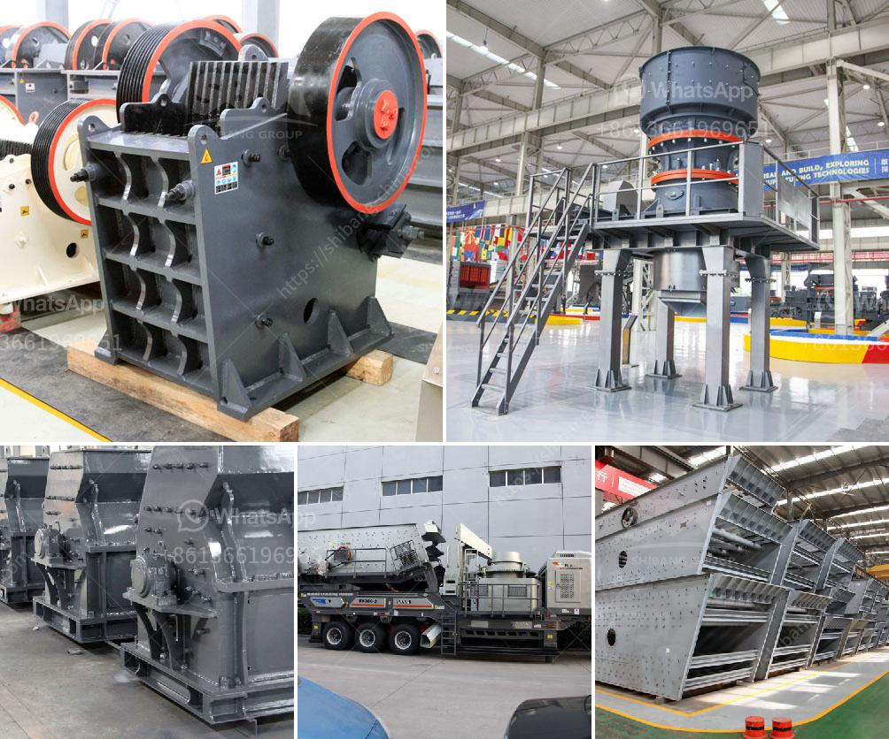

<h3>coal washing machine for sale</h3>
Coal washing machine for sale is a dedicated equipment to wash coal and remove the impurities in the coal, the commonly used coal washing machine is spiral classifier. However, spiral classifier is only used for washing coal, while the other coal washing machine is based on different purposes and different material of coal, so we also have other types of coal washing machines.

Since the launch of the product, the coal washing machine has been welcomed by customers all over the world. The sales of coal washing machines are well-received in the market. There are many coal washing machine suppliers, and the quality of the equipment is different. As a professional coal washing machine manufacturer, LZZG can provide customers with high-quality coal washing machines with excellent performance and reasonable prices.

The development of coal washing machines is in response to the quality requirements of raw coal. The steady growth of domestic coal production and the expanding demand for coal products have promoted the development of coal washing machines. Coal washing machines can process coal with impurities such as sand, iron, dust, and dirt. The process performance of coal washing machine directly affects the operation of the coal washing plant and the economic benefits of coal enterprises.

The working principle of coal washing machine is: The impurities in raw coal are separated from the coal particles by the gravity separation process, and the light and heavy materials are separated by the different settling velocities in the medium. The product with good separation effect is discharged from the discharge port at the upper part of the coal washing machine, and the impurities are discharged from the lower part.

2. Reducing the ash content in coal to increase its heating value and reduce emissions during combustion.

3.Cost-effective: The coal washing machine has a simple structure and is easy to operate. It can save water resources and reduce production costs while improving coal quality.

In summary, coal washing machines play an important role in the coal preparation process, providing a reliable guarantee for the efficient utilization of coal resources. With the continuous development of the coal industry, the demand for coal washing machines in the market will continue to increase. As a professional coal washing machine manufacturer, LZZG will continue to improve the quality of equipment and provide customers with better coal washing solutions. If you need a coal washing machine, please contact us, LZZG will serve you wholeheartedly!
<h3>Contact us</h3><ul><li><strong>Whatsapp:&nbsp;<a href="https://wa.me/8613661969651">+8613661969651</a></strong></li><li><a href="https://swt.shibang-china.com/?git&amp;zhl&amp;coal washing machine for sale"><strong>Online Service(chat now)</strong></a></li></ul><h3>Related</h3><ul><li><a href='kaolin processing machinery.md'>kaolin processing machinery</a></li><li><a href='ball mill in wait of ball.md'>ball mill in wait of ball</a></li><li><a href='supplier of granite crusher.md'>supplier of granite crusher</a></li><li><a href='basalt rebar production line.md'>basalt rebar production line</a></li><li><a href='used ball milling machine for sale canada.md'>used ball milling machine for sale canada</a></li></ul>