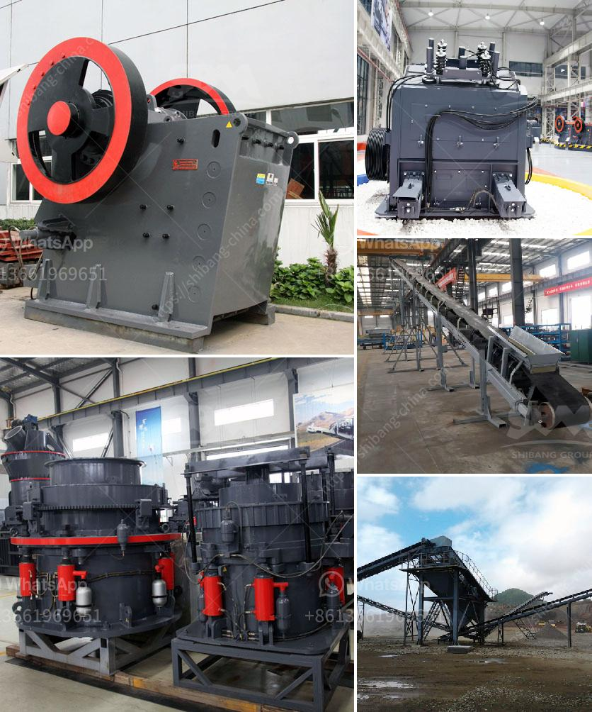

<h3>coal washing process yotube</h3>
Coal washing is a crucial step in the production of coal, as it enhances the quality and purity of the product. The process efficiently removes impurities, such as ash and sulfur, thereby increasing the value of coal. A popular source for learning about the coal washing process is YouTube, where numerous informative videos explain the different stages involved.

Typically, coal washing follows a series of steps that start with the excavation of raw coal from mines. Once it arrives at the washing plant, the coal is dumped into a hopper, where it is fed into a primary crusher. This machine breaks the larger chunks into smaller sizes for further processing.

Next, the coal passes through a series of screens that separate it into different sizes. This process ensures uniformity in the final product, allowing for efficient combustion when used as fuel. Additionally, the screens remove any oversized particles that may hinder the washing process later on.

After screening, the coal is mixed with water and introduced to the first stage of the washing process: dense medium separation (DMS). DMS involves suspending the coal in a fluid with a specific density, allowing the heavier impurities to sink while the lighter coal floats. This separation helps eliminate unwanted materials such as rocks, clay, and stones.

Following DMS, the coal undergoes flotation, where it is mixed with a reagent that creates a froth. The froth then carries away impurities like sulfur, which can lead to environmental pollution when emitted during combustion. This stage efficiently removes these pollutants, enhancing the quality of the coal.

Lastly, the clean coal is dewatered to reduce its moisture content. This step is vital for transportation and storage, as high moisture levels can result in lower combustion efficiency. The dewatering process involves using centrifuges or filters to remove excess moisture, allowing the coal to be more easily handled and improving its overall quality.

With numerous YouTube videos available on the coal washing process, viewers can gain valuable insights into the techniques employed in this industry. These videos showcase real-world examples, illustrating the importance of coal washing in producing high-quality coal that meets environmental standards. Additionally, they provide a platform for professionals in the field to share their knowledge and developments, fostering innovation and improvement in the coal washing process.

In conclusion, coal washing through the various stages of screening, dense medium separation, flotation, and dewatering plays a crucial role in enhancing the quality of coal. YouTube serves as an excellent platform to learn about these processes, as it offers a wealth of informative videos created by experts and industry professionals. Through these resources, individuals can gain a comprehensive understanding of the coal washing process and its significance in improving the value and environmental impact of coal.
<h3>Contact us</h3><ul><li><strong>Whatsapp:&nbsp;<a href="https://wa.me/8613661969651">+8613661969651</a></strong></li><li><a href="https://swt.shibang-china.com/?git&amp;zhl&amp;coal washing process yotube"><strong>Online Service(chat now)</strong></a></li></ul><h3>Related</h3><ul><li><a href='spare parts for a jaw crusher.md'>spare parts for a jaw crusher</a></li><li><a href='price of quarry crusher machines.md'>price of quarry crusher machines</a></li><li><a href='malaysia conveyor belts.md'>malaysia conveyor belts</a></li><li><a href='used floor grinding machines for sale.md'>used floor grinding machines for sale</a></li><li><a href='used vertical ball mill 200tph capacity.md'>used vertical ball mill 200tph capacity</a></li></ul>