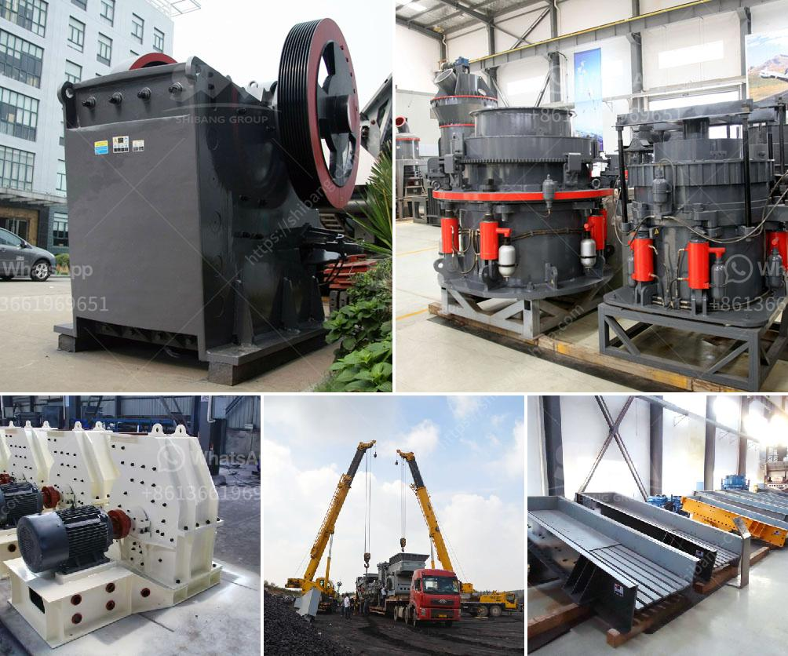

<h3>cobalt ore mining processing plant</h3>
Cobalt, a silver-gray metal, has gained significant attention in recent years due to its increasing demand in various industries, such as electric vehicle (EV) manufacturing, aerospace, and renewable energy. With its unique properties, including high melting point, corrosion resistance, and excellent thermal stability, cobalt has become an essential component in the development of advanced technologies.

To meet the growing global demand, cobalt ore mining processing plants have been established in various regions worldwide. These plants are designed to extract and process cobalt from the Earth's crust efficiently.

At the cobalt ore mining processing plant, raw ore is extracted through conventional open-pit mining techniques. This method is followed by ore beneficiation, a process that involves crushing, grinding, flotation, and magnetic separation. This process takes place in specially designed plant facilities that ensure optimal productivity and minimal environmental impact.

Once the cobalt ore is obtained, it goes through a series of steps to obtain pure cobalt. The extracted ore undergoes a refining process, which involves smelting to remove impurities. The resulting cobalt concentrate is then further processed using hydrometallurgical methods to produce high-purity cobalt compounds or metal.

One of the critical factors in cobalt processing is the reduction of environmental impact. Mining companies are taking various measures to minimize their ecological footprint by incorporating sustainable practices and innovative technologies. These include the use of renewable energy sources to power the processing plants, implementing water recycling systems, and adopting responsible waste management practices.

Additionally, health and safety precautions are of utmost importance in cobalt ore mining and processing plants. Strict protocols and guidelines are put in place to protect workers from exposure to hazardous materials and to ensure their well-being.

As the demand for cobalt continues to rise, the establishment of cobalt ore mining processing plants plays a crucial role in ensuring the availability of this essential resource. By adhering to sustainable practices and robust safety measures, these plants contribute to both economic growth and environmental protection.
<h3>Contact us</h3><ul><li><strong>Whatsapp:&nbsp;<a href="https://wa.me/8613661969651">+8613661969651</a></strong></li><li><a href="https://swt.shibang-china.com/?git&amp;zhl&amp;cobalt ore mining processing plant"><strong>Online Service(chat now)</strong></a></li></ul><h3>Related</h3><ul><li><a href='rock crusher used in mining and quarry for sale.md'>rock crusher used in mining and quarry for sale</a></li><li><a href='flowchart diagram for cement plant.md'>flowchart diagram for cement plant</a></li><li><a href='flow chart of three stage agreegate crushing plant.md'>flow chart of three stage agreegate crushing plant</a></li><li><a href='stone crusher seller.md'>stone crusher seller</a></li><li><a href='pe 200 x 300 stone crusher.md'>pe 200 x 300 stone crusher</a></li></ul>