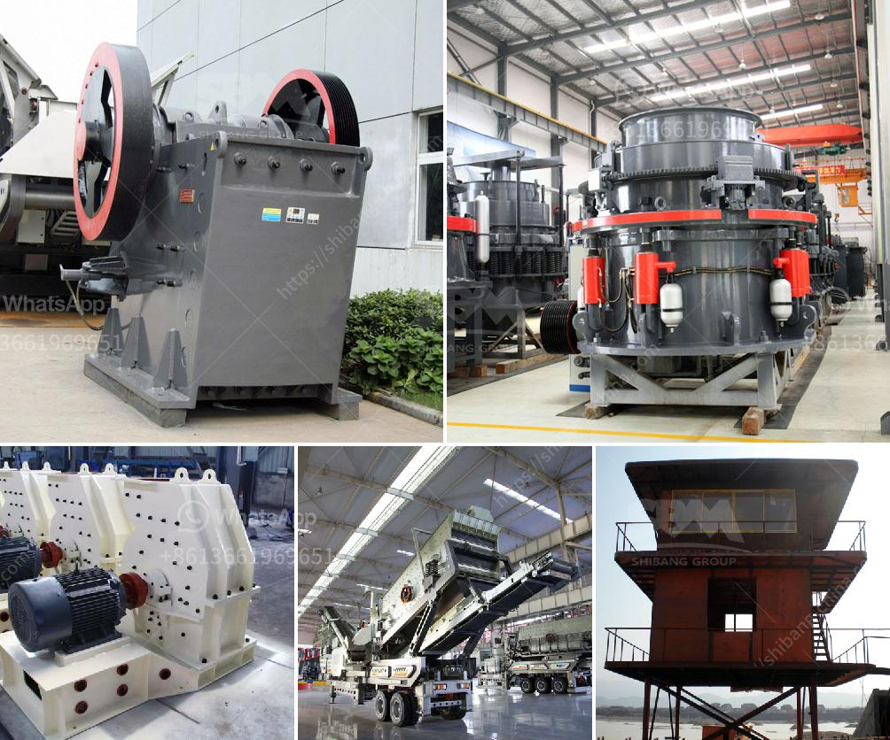

<h3>cobalt ore processing plant setup cost</h3>
Cobalt, a striking blue metal, is an essential component in many of the technologies we rely on today. From electric vehicle batteries to smartphones and laptops, cobalt plays a crucial role in powering our modern world. With the increasing demand for cobalt, setting up a cobalt ore processing plant has become an attractive investment opportunity. However, it is important to understand the setup cost involved in such a venture.

The first step in setting up a cobalt ore processing plant is locating the source of the cobalt. Cobalt mines are typically found in regions rich in nickel, copper, and other base metals. Africa, particularly the Democratic Republic of Congo (DRC), is the largest supplier of cobalt globally. It is estimated that around 70% of the world's cobalt comes from this region. Other notable cobalt-producing countries include Russia, Australia, and Canada.

Once a suitable mining location is identified, the next step is to set up the processing plant. The exact cost of setting up a cobalt ore processing plant can vary depending on a range of factors, such as the size of the operation, the nature of the ore, and the location. A small-scale processing plant with a capacity of 300-500 tons per year can cost anywhere from several hundred thousand to a few million dollars.

The main cost drivers in setting up a cobalt ore processing plant are the equipment costs, which include crushers, conveyors, screens, and grinding mills. In addition to the equipment, the plant also requires infrastructure investments for water supply, power connection, and waste management systems.

Another significant cost factor is the labor required to operate and maintain the plant. Skilled technicians and engineers are needed to ensure the smooth operation and efficient processing of the ore. Labor costs can vary depending on the country and region where the plant is located. For example, labor costs in a developed country such as the United States would be significantly higher compared to a developing country like the DRC.

Furthermore, regulatory requirements and compliance costs should also be taken into account. Environmental regulations and health and safety standards must be followed to ensure the responsible extraction and processing of cobalt. Compliance with these regulations may require additional investments in pollution control systems and waste treatment facilities.

Despite the setup costs involved, investing in a cobalt ore processing plant can be financially rewarding in the long run. With the increasing demand for cobalt-driven by the rise of electric vehicle production and renewable energy technologies-the market for cobalt is projected to experience significant growth.

Moreover, setting up a processing plant in close proximity to the mining site can help reduce transportation costs and improve the overall efficiency of the operation. This proximity also enables the plant to benefit from local infrastructure and support services, further reducing operational expenses.

In conclusion, the setup cost of a cobalt ore processing plant can vary depending on various factors such as the scale of the operation, location, and labor costs. Although initial investments can be substantial, the long-term prospects of the cobalt market make such ventures attractive. By investing in responsible and efficient cobalt ore processing, we can contribute to meeting the growing demand for this crucial metal and support the development of sustainable technologies.
<h3>Contact us</h3><ul><li><strong>Whatsapp:&nbsp;<a href="https://wa.me/8613661969651">+8613661969651</a></strong></li><li><a href="https://swt.shibang-china.com/?git&amp;zhl&amp;cobalt ore processing plant setup cost"><strong>Online Service(chat now)</strong></a></li></ul><h3>Related</h3><ul><li><a href='hand powered rock crusher binq mining.md'>hand powered rock crusher binq mining</a></li><li><a href='30 tons per hour washing plant gold.md'>30 tons per hour washing plant gold</a></li><li><a href='bentonite clay powder process equipment.md'>bentonite clay powder process equipment</a></li><li><a href='jaw crushers kyrgyzstan.md'>jaw crushers kyrgyzstan</a></li><li><a href='mill crusher pigment manufacturer in kenya.md'>mill crusher pigment manufacturer in kenya</a></li></ul>