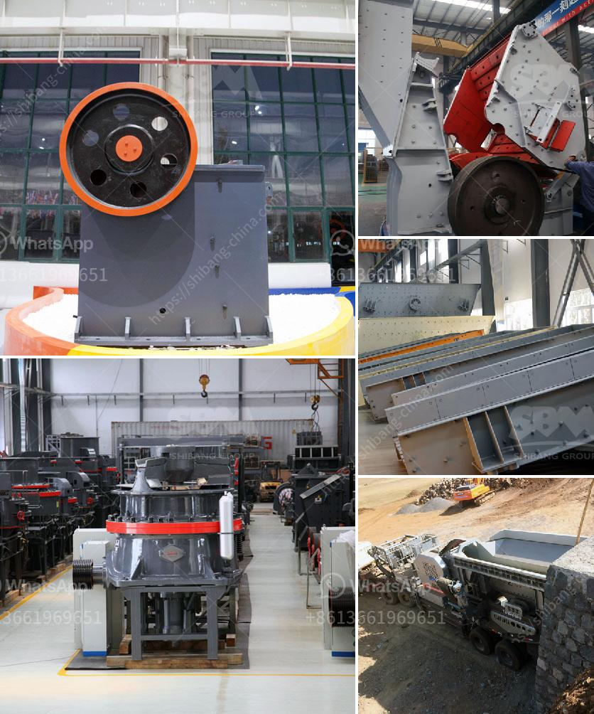

<h3>cobble crusher supplier</h3>
The cobblestone crushing equipment is an essential equipment in the mining and construction industry. Not only does it crush various stones, but it also helps in the recycling of waste materials. With its ability to withstand harsh environments, the cobble crusher is a reliable and affordable option for many mining companies.

One of the leading cobble crusher suppliers in the market is (company name). They have been providing high-quality equipment to the mining industry for (number of years). With their extensive experience, they understand the requirements and challenges faced by mining companies and offer customized solutions to meet their needs.

The cobble crusher offered by (company name) is known for its exceptional performance and durability. It can easily crush cobblestones of different sizes without causing any damage. The crusher is designed with advanced technology to ensure efficient crushing and minimal maintenance.

What sets (company name) apart from other suppliers is their commitment to customer satisfaction. They take pride in their superior customer service, ensuring that their clients receive prompt assistance and support whenever needed. Their team of professionals is highly knowledgeable and can guide customers in selecting the right crusher based on their specific requirements.

In addition to providing top-notch equipment, (company name) also offers competitive prices, making them an ideal choice for both big and small mining companies. They prioritize quality without compromising affordability, making them a reliable and cost-effective solution for their customers.

As the mining industry continues to grow, the demand for cobble crushers is also expected to rise. Therefore, it is crucial for mining companies to choose a reputable supplier who can meet their needs effectively. With (company name), customers can have peace of mind, knowing that they are receiving a high-quality product that will withstand the tough mining conditions.

In conclusion, (company name) is a reliable cobble crusher supplier that offers top-notch equipment at competitive prices. With its commitment to customer satisfaction and unrivaled expertise, they are the go-to choice for many mining companies. Investing in their cobble crushers will not only enhance productivity but also contribute to the overall success of mining operations.
<h3>Contact us</h3><ul><li><strong>Whatsapp:&nbsp;<a href="https://wa.me/8613661969651">+8613661969651</a></strong></li><li><a href="https://swt.shibang-china.com/?git&amp;zhl&amp;cobble crusher supplier"><strong>Online Service(chat now)</strong></a></li></ul><h3>Related</h3><ul><li><a href='how to start a robo sand machinery.md'>how to start a robo sand machinery</a></li><li><a href='small concrete crusher used.md'>small concrete crusher used</a></li><li><a href='silica sand plant supplier in malaysia.md'>silica sand plant supplier in malaysia</a></li><li><a href='vertical mill mining.md'>vertical mill mining</a></li><li><a href='egypt aggregate stone for concrete prices.md'>egypt aggregate stone for concrete prices</a></li></ul>