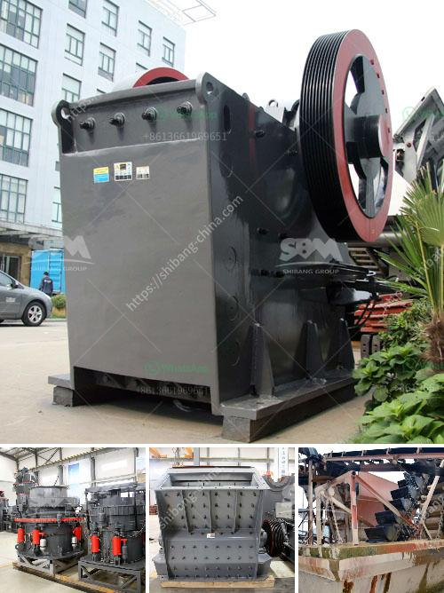

<h3>company profile for suppliers of mining equipment</h3>
Mining is an essential industry that helps in the extraction of valuable minerals or geological materials from the earth. To carry out these operations efficiently, mining companies rely heavily on the use of specialized equipment. Suppliers of mining equipment play a crucial role in meeting the industry's demands by providing high-quality machinery and innovative solutions to improve productivity and safety.

One prominent supplier in this industry is [Company Name], a leading provider of mining equipment. With over [number of years] of experience, [Company Name] has established a strong reputation for delivering reliable and efficient solutions to mining companies worldwide.

[Company Name] offers a comprehensive range of mining equipment that caters to various stages of the mining process. From exploration to production, the company provides cutting-edge machinery that ensures optimal performance. Their product range includes:

To identify potential mineral deposits, exploration equipment is vital. [Company Name] offers state-of-the-art machinery, such as drilling rigs, air compressors, and geophysical survey equipment. These tools provide accurate data, helping mining companies make informed decisions during the exploration phase.

Once mineral deposits are discovered, mining equipment is used to extract the valuable resources from the earth. [Company Name] provides a wide array of machinery, including excavators, haul trucks, loaders, and crushing equipment. These machines are designed to withstand harsh mining conditions while increasing productivity and minimizing downtime.

After extraction, minerals often require processing before they can be used commercially. [Company Name] offers a range of processing equipment, such as crushers, screens, and mills, to efficiently prepare the extracted minerals for further refinement. Their machinery is engineered to maximize recovery rates and minimize waste, resulting in higher-quality end products.

Safety is of paramount importance in the mining industry. [Company Name] understands the need for a safe working environment and offers a range of safety equipment to protect workers from potential hazards. This includes personal protective equipment, gas detection systems, and emergency response equipment, ensuring the well-being of mining personnel.

[Company Name] is committed to delivering products of the highest quality. Their equipment is manufactured using the latest technology and adheres to stringent industry standards. Each machine undergoes rigorous testing before it is delivered to the client, ensuring optimal performance and longevity.

In addition to product quality, [Company Name] also places great emphasis on customer support. They have a dedicated team of experts who provide technical assistance, maintenance, and on-site training, ensuring that mining companies can fully maximize the potential of their equipment.

In the ever-evolving mining industry, suppliers of mining equipment have a critical role to play. [Company Name] has established itself as a reliable and innovative provider of mining machinery, offering a comprehensive range of equipment to meet the industry's needs. With their commitment to quality and customer support, [Company Name] continues to empower mining companies worldwide, contributing to the growth and success of the industry.
<h3>Contact us</h3><ul><li><strong>Whatsapp:&nbsp;<a href="https://wa.me/8613661969651">+8613661969651</a></strong></li><li><a href="https://swt.shibang-china.com/?git&amp;zhl&amp;company profile for suppliers of mining equipment"><strong>Online Service(chat now)</strong></a></li></ul><h3>Related</h3><ul><li><a href='cyclone sand separator for sand mining.md'>cyclone sand separator for sand mining</a></li><li><a href='ball mills in solidwork.md'>ball mills in solidwork</a></li><li><a href='hp cone crusher device.md'>hp cone crusher device</a></li><li><a href='industrial application ball mill.md'>industrial application ball mill</a></li><li><a href='stone crusher manufacturers in india.md'>stone crusher manufacturers in india</a></li></ul>