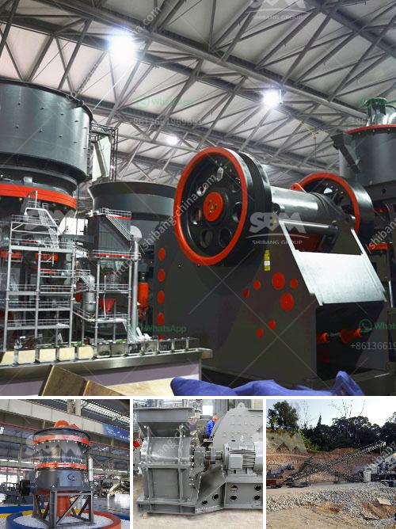

<h3>complete authentic mining busines plan template</h3>
A mining business plan serves as a crucial blueprint for entrepreneurs and investors looking to start their mining venture. A well-drafted and comprehensive plan not only outlines the mining operation's goals and objectives, but it also provides a strategic roadmap to achieve success.

The first section of a mining business plan typically focuses on the company's executive summary. This section highlights the mining operation's purpose, vision, and core values. It also includes an overview of the company's management team, their experience, and expertise.

The next section of the plan delves into the mining operation's market analysis. It analyzes the current market trends, competitors, and potential target customers. This analysis helps to identify the unique selling points that differentiate the mining venture from its competitors.

Furthermore, the mining business plan must present a detailed description of the mining operation, including the location, type of resources to be mined, extraction process, and equipment requirements. This section also outlines the environmental and regulatory considerations, ensuring compliance with local laws and regulations.

Financial projections are a critical aspect of any mining business plan. This section includes projected revenue, expenses, and profitability over a defined period. It outlines the capital investment required, operational costs, and anticipated returns. Additionally, it discusses funding options, including potential investors or financing avenues.

Lastly, the mining business plan should encompass a well-defined marketing and sales strategy. This strategy identifies the target market, marketing channels, and promotional activities to attract customers and generate revenue. It may also explore potential partnerships or offtake agreements with other industry players.

In conclusion, a complete and authentic mining business plan template provides a comprehensive roadmap for entrepreneurs and investors. It covers various aspects such as the executive summary, market analysis, operations description, financial projections, and marketing strategy. With a well-crafted plan, mining ventures can be executed effectively and efficiently, ensuring long-term success in the industry.
<h3>Contact us</h3><ul><li><strong>Whatsapp:&nbsp;<a href="https://wa.me/8613661969651">+8613661969651</a></strong></li><li><a href="https://swt.shibang-china.com/?git&amp;zhl&amp;complete authentic mining busines plan template"><strong>Online Service(chat now)</strong></a></li></ul><h3>Related</h3><ul><li><a href='quartz crushing process.md'>quartz crushing process</a></li><li><a href='feldspar crusher price.md'>feldspar crusher price</a></li><li><a href='grinding machine in greece.md'>grinding machine in greece</a></li><li><a href='roller conveyor belts.md'>roller conveyor belts</a></li><li><a href='ball mills for sale.md'>ball mills for sale</a></li></ul>