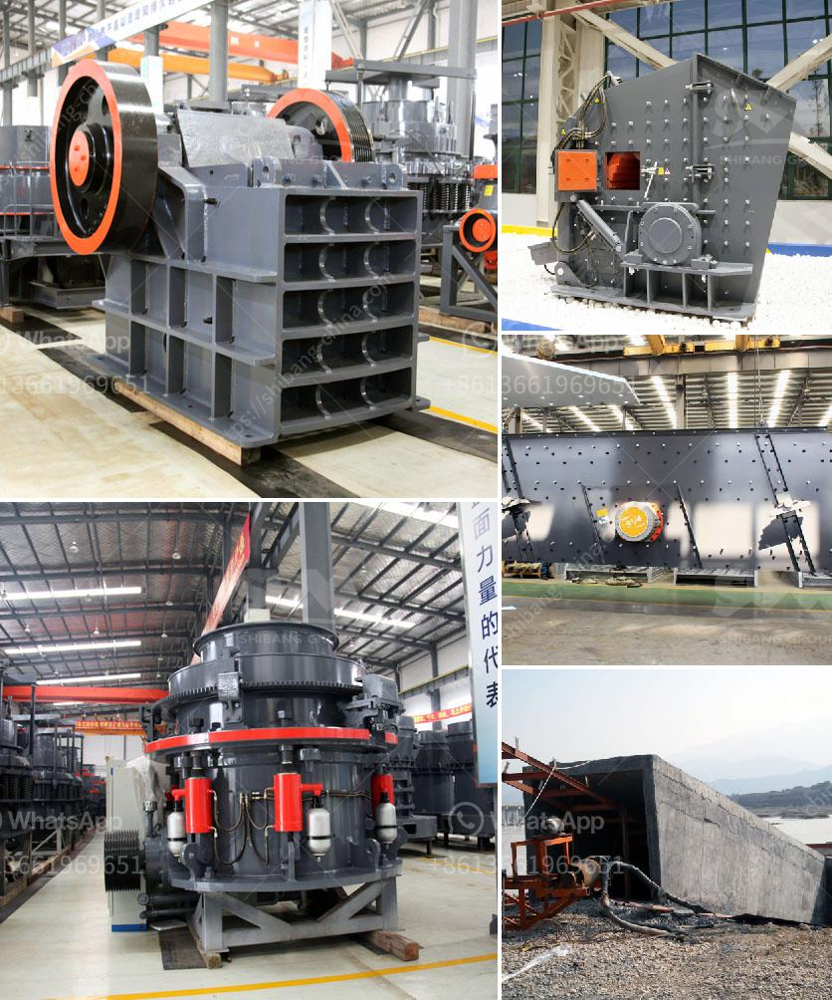

<h3>complete crusher plant for sale</h3>
Crusher plant is continuous working equipment that takes various advantages as compared to traditional machines like loaders and dumpers. Technology-driven crusher plants can set up in a small area within the site to offer efficient services, including crushing, screening, conveying, and storage. They have all the equipment needed to mine and break down large pieces of aggregate material. The crusher plant is available for sale in a wide range of sizes and capacities.

A crusher plant is made up of a variety of components, including a vibrating feeder, jaw crusher, impact crusher, cone crusher, vibrating screen, belt conveyor, and various additional auxiliary equipment. All these machines work in collaboration to complete the entire process of material crushing.

The vibrating feeder feeds the materials into the jaw crusher for primary crushing. The crushed materials are then sent to the impact crusher for secondary crushing by the belt conveyor. After the secondary crushing process, the materials are screened by a vibrating screen to achieve various sizes of final products. The sizes that meet the requirements are transported by the belt conveyor to the finished product storage yard and the sizes that do not meet the requirements are returned to the impact crusher for re-crushing.

Besides the primary and secondary crushers, there are also tertiary and quaternary crushers. Tertiary crushers are used to produce finely crushed material, suitable for final products like concrete or asphalt. Quaternary crushers are mostly cone crushers that are used in the final stage of crushing, producing the final product shape.

In addition to the crushing process, various auxiliary equipment is installed to assist in the overall operation of the crusher plant. For example, a dust collector system is used to control dust pollution during the crushing process. A control panel is installed to monitor and control the entire plant operation, ensuring smooth and efficient functioning. Additionally, a generator set is often provided to ensure continuous power supply, especially in remote locations.

The crusher plant is designed to be flexible and portable, meaning it can be easily transported from one location to another. This allows for greater flexibility in terms of site selection and saves transportation costs. It also enables quick installation and dismantling, making it ideal for temporary projects or seasonal operations.

When choosing a crusher plant for sale, it is important to consider factors such as the capacity, types of materials being crushed, desired final product size, and budget. It is necessary to find a reliable supplier that offers high-quality equipment and after-sales support to ensure the smooth operation of the crusher plant.

In conclusion, a complete crusher plant consists of primary, secondary, tertiary, and quaternary crushers, vibrating feeder, screen, and various auxiliary equipment. It offers a wide range of capacities and sizes for different applications. When purchasing a crusher plant, it is crucial to consider the efficiency, portability, and reliability of the equipment. By investing in a well-designed and maintained crusher plant, quarry operators can increase productivity, reduce operational costs, and achieve better overall performance.
<h3>Contact us</h3><ul><li><strong>Whatsapp:&nbsp;<a href="https://wa.me/8613661969651">+8613661969651</a></strong></li><li><a href="https://swt.shibang-china.com/?git&amp;zhl&amp;complete crusher plant for sale"><strong>Online Service(chat now)</strong></a></li></ul><h3>Related</h3><ul><li><a href='small ball mill for alumina.md'>small ball mill for alumina</a></li><li><a href='rock crusher unit.md'>rock crusher unit</a></li><li><a href='used sand screening plant for sale in uae.md'>used sand screening plant for sale in uae</a></li><li><a href='wet wet grinding mills.md'>wet wet grinding mills</a></li><li><a href='cement plant process in south africa.md'>cement plant process in south africa</a></li></ul>