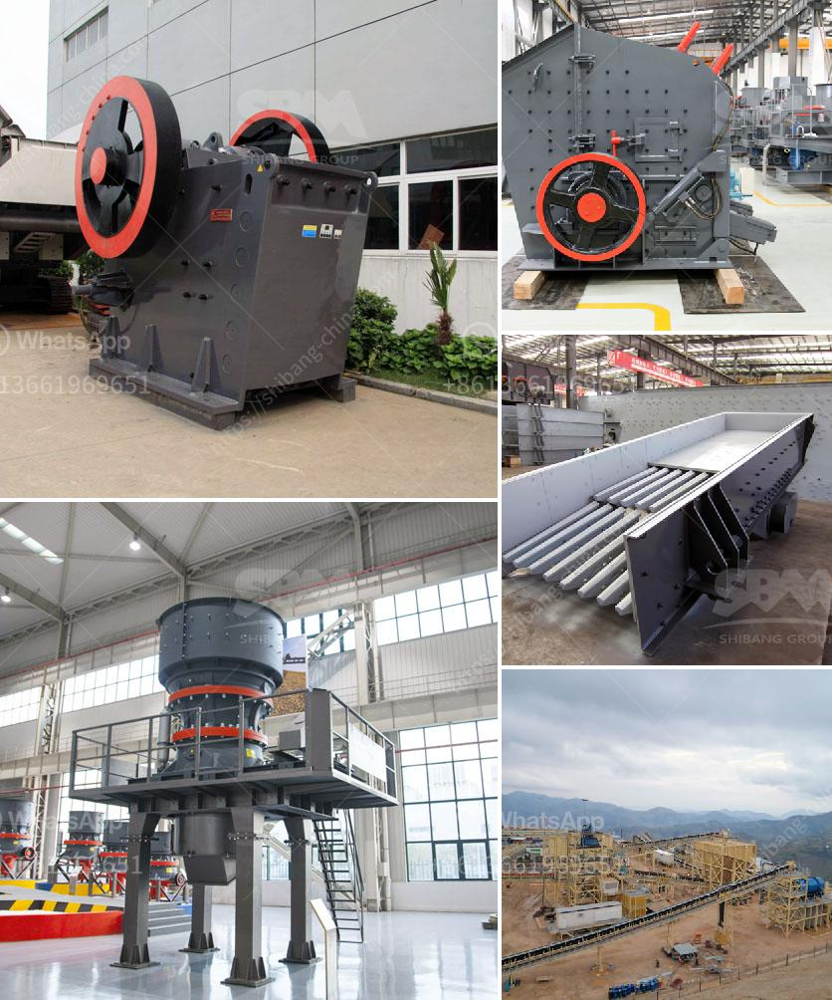

<h3>complete crushing plant</h3>
A complete crushing plant is a facility that processes materials such as natural rocks, coarse and fine aggregates, gravel, sand, and ores into smaller pieces. This plant includes a variety of equipment such as feeding system, crushing system, screening system, and conveying system. They are commonly used in construction, mining, and recycling industries to process different types of materials efficiently.

The feeding system of a complete crushing plant typically consists of a vibrating feeder or a hopper that promotes the even distribution of materials to the jaw crusher or primary crusher. This part of the plant ensures that the materials are fed evenly and continuously, preventing any blockages or uneven wear on the crusher's components.

The crushing system is the primary stage of the processing plant, where the large rocks or ores are broken down into smaller pieces. The most common type of crusher used in this process is the jaw crusher. Jaw crushers have been used for decades in the mining and construction industries due to their ability to crush even the hardest of materials. They work by compressing the material between two plates, known as jaws, which move towards each other at a fixed angle. The broken pieces then fall down into a secondary crusher, such as an impact crusher or cone crusher, which further reduces their size.

After the materials are crushed, they pass through the screening system of the complete crushing plant. This system ensures that only the desired particle sizes are retained, while the oversize materials are sent back to the crusher for further processing. The screening system consists of multiple vibrating screens with different mesh sizes that separate the materials based on their size. This step is crucial in producing aggregates and sand of the desired size and shape.

The conveying system is responsible for transporting the processed materials from one part of the plant to another. It includes various types of conveyors, such as belt conveyors, screw conveyors, and bucket elevators. These conveyors are designed to handle different types of materials and transfer them efficiently to the desired location within the plant.

A complete crushing plant offers numerous benefits to the construction, mining, and recycling industries. By processing the materials on-site, these industries can reduce transportation costs and minimize the impact on the environment. Moreover, the ability to produce different types of aggregates, sand, and other materials in one location allows for flexibility and efficiency in meeting the specific requirements of various construction projects.

In conclusion, a complete crushing plant is a versatile facility that processes different types of materials efficiently. With its various components, such as the feeding system, crushing system, screening system, and conveying system, it offers numerous benefits to the construction, mining, and recycling industries. By having a complete crushing plant on-site, these industries can save costs, reduce environmental impact, and meet the specific requirements of various projects.
<h3>Contact us</h3><ul><li><strong>Whatsapp:&nbsp;<a href="https://wa.me/8613661969651">+8613661969651</a></strong></li><li><a href="https://swt.shibang-china.com/?git&amp;zhl&amp;complete crushing plant"><strong>Online Service(chat now)</strong></a></li></ul><h3>Related</h3><ul><li><a href='portable crushing.md'>portable crushing</a></li><li><a href='cost for small cement plant setup.md'>cost for small cement plant setup</a></li><li><a href='stone crusher ethiopia.md'>stone crusher ethiopia</a></li><li><a href='hammer mill equipment.md'>hammer mill equipment</a></li><li><a href='different types of roller milling.md'>different types of roller milling</a></li></ul>