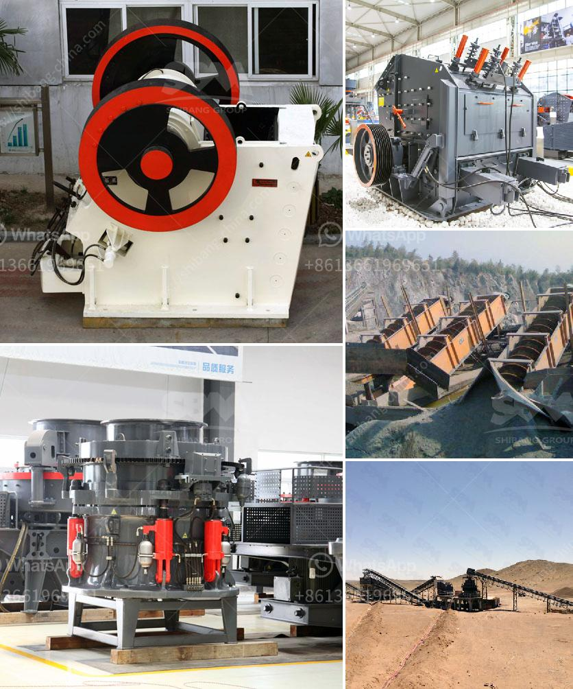

<h3>complete stone crushing plant</h3>
A stone crushing plant is primarily involved in the manufacture of aggregates of various sizes (coarse aggregates, crusher run, rock sand and other fine aggregates) from basalt boulders. Coarse aggregates are usually used in ready mix concrete and asphaltic concrete. Crusher run is used for the bases and sub-bases for road making. 

Fine aggregates are used for the production of concrete and plastering. The processes involved in stone crushing include pre-processing, crushing, washing, screening and recycling of wastewater. 

Pre-processing consists of removal of stone boulders by mechanical means and screening of the boulders in a feed hopper to remove soil and small rocks. Crushing entails primary, secondary and tertiary crushing of the boulders into the aggregates. Washing and screening consist of further screening the aggregates through a vibrating screen and sand classifier. 

Recycling of wastewater consists of channeling the effluents from the process to a sedimentation pond for recycling. The collected water is subsequently reused in the process. This complete plant is designed to produce aggregates for the construction industry. 

With the development of construction industry, the demand for aggregate is increasing for projects such as roads, bridges, railways, airports and so on. Therefore, the plant will be ideal for small and medium-scale construction hires. 

Overall, the stone crushing plant is an excellent solution as aggregates are the major building block for the construction industry. With the growing demand for aggregates, the stone crushing plant is expected to increase in productivity and efficiency. It's a cost-effective solution for small and medium-sized construction projects that require high-quality aggregates.
<h3>Contact us</h3><ul><li><strong>Whatsapp:&nbsp;<a href="https://wa.me/8613661969651">+8613661969651</a></strong></li><li><a href="https://swt.shibang-china.com/?git&amp;zhl&amp;complete stone crushing plant"><strong>Online Service(chat now)</strong></a></li></ul><h3>Related</h3><ul><li><a href='smallest cement plant.md'>smallest cement plant</a></li><li><a href='quartz crushers price in india.md'>quartz crushers price in india</a></li><li><a href='talc powder importer in europe.md'>talc powder importer in europe</a></li><li><a href='stamp mill machine south africa.md'>stamp mill machine south africa</a></li><li><a href='used floor grinding machines for sale.md'>used floor grinding machines for sale</a></li></ul>