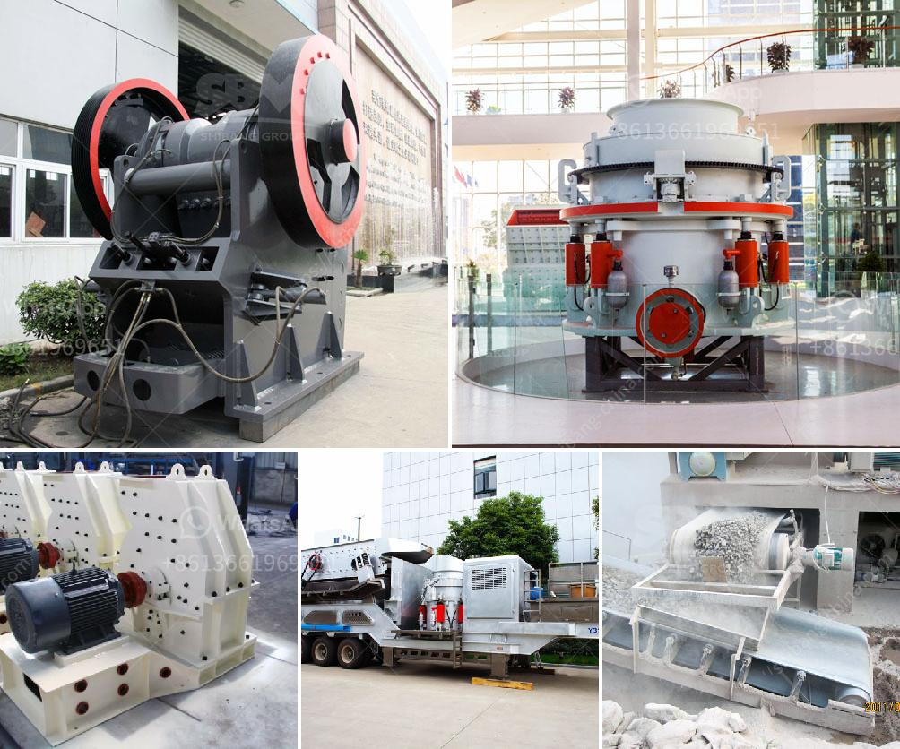

<h3>components of the hammer crusher</h3>
The hammer crusher is a type of ore crushing equipment. It can be used to crush medium-hard brittle materials with low water content, such as limestone, gypsum, slag, coke, coal, etc. It is widely used in cement manufacturing, chemical, electric power, metallurgy, and other industries. As a type of cement crushers, hammer crushers are often used in cement plants for raw material preparation and clinker grinding.

  - High-speed hammer crusher: referred to as hammer crusher, which is a device for crushing materials with a particle size of 600-1800 mm to 25 mm or below. The hammer crusher has a high speed, a large crushing ratio, and a high output. It is divided into two types: single rotor and double rotor.

  - Fixed hammer crusher: The axis of the rotor is fixed, and the hammer swings at a high speed. The hammer crusher is suitable for fine grinding of medium-hard and soft rock materials.

  - Reverse hammer crusher: The rotor’s direction of rotation is reversed, allowing the hammer heads to be used on both sides. The hammer crusher is used to crush brittle materials with low moisture content, such as limestone, gypsum, chalk, clay, etc.

Hammer crusher mainly consists of frame, rotor, support iron, grate bars and other components. The frame is divided into two parts: upper part and lower part, which are welded by steel plates after being cut. Liners made of high manganese steels within the frame can be replaced after being worn out.

The rotor consists of the main shaft, hammer frame plate, hammer heads, pin shafts, bearings, and other components. The frame is constantly impacted by the impact force of the hammer heads, leading to its fatigue fracture.

The grate bars are arranged at the bottom of the rotor for screening materials. The smaller materials that are crushed to the required particle size are discharged through the grate openings. To prevent the grate bars from being damaged by iron or non-crushed materials, a chain curtain is hung between the upper part of the grate bars and the rotor.

6. Check the tightness of the connection bolts and fasteners, and tighten or replace them if necessary.

7. Ensure that the equipment is operated strictly in accordance with the operating procedures and safety precautions.

In conclusion, the hammer crusher is a type of ore crushing equipment used in cement, metallurgy, chemical, electric power, and other industries, mainly suitable for medium-hard materials. Different types of hammer crushers have different components and maintenance requirements.
<h3>Contact us</h3><ul><li><strong>Whatsapp:&nbsp;<a href="https://wa.me/8613661969651">+8613661969651</a></strong></li><li><a href="https://swt.shibang-china.com/?git&amp;zhl&amp;components of the hammer crusher"><strong>Online Service(chat now)</strong></a></li></ul><h3>Related</h3><ul><li><a href='mobile crusher discount.md'>mobile crusher discount</a></li><li><a href='sand crusher company in nigeria.md'>sand crusher company in nigeria</a></li><li><a href='quartz stone crushers materials.md'>quartz stone crushers materials</a></li><li><a href='hammer crusher dimension.md'>hammer crusher dimension</a></li><li><a href='used portable crusher plant for sale dubai.md'>used portable crusher plant for sale dubai</a></li></ul>