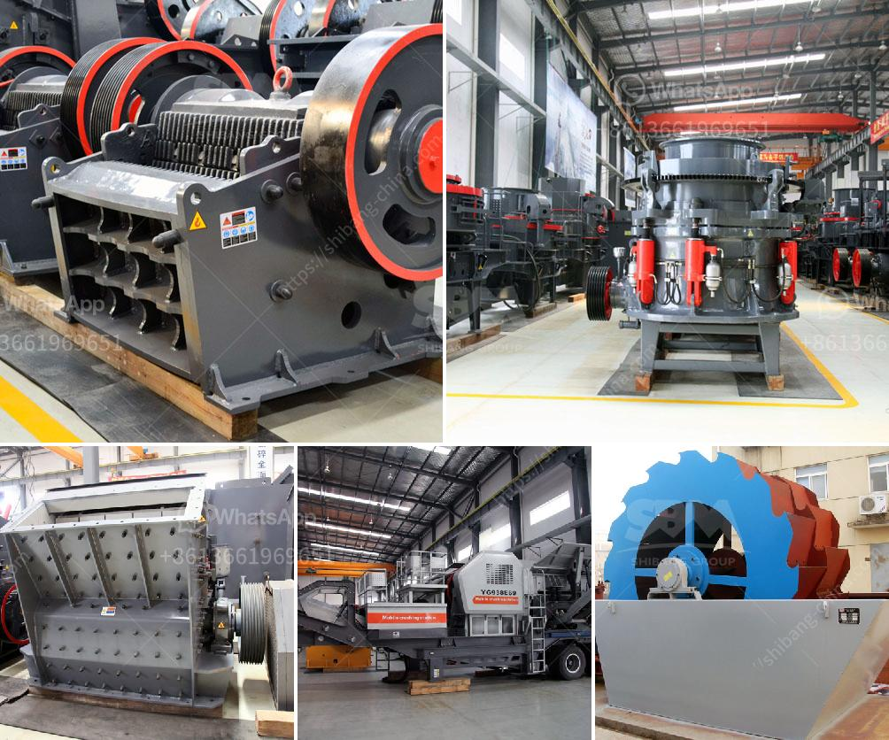

<h3>concrete conveyor belts</h3>
In the world of construction, any innovation that can enhance efficiency and productivity is highly valued. One such innovation that has revolutionized the construction industry is the concrete conveyor belt. These reliable and versatile machines have made the transportation and placement of concrete quicker, easier, and more precise.

A concrete conveyor belt, also known as a concrete placing boom, is a machine consisting of a long belt that travels on a series of rotating drums. With a conveyor belt, construction workers can easily transport concrete from the mixer to the desired location, whether it is a high-rise building, a bridge, or a tunnel. This technology eliminates the need for manual labor, reducing the risk of injuries and increasing productivity.

One of the main advantages of using a concrete conveyor belt is the speed at which concrete can be poured. Traditionally, workers had to manually transport concrete using wheelbarrows or buckets, which was not only time-consuming but also physically demanding. With a conveyor belt, the process is automated, allowing for a continuous flow of concrete to be delivered to the construction site. This results in significant time savings, enabling projects to be completed faster and more efficiently.

Moreover, concrete conveyor belts offer precise placement of concrete, ensuring that it is distributed evenly and accurately. The length and height of the conveyor belt can be adjusted to meet the specific requirements of the project, allowing for versatile applications. This precision eliminates the need for workers to manually manipulate and distribute the concrete, reducing the chances of errors and inconsistencies. As a result, the finished structure exhibits higher quality and durability.

In addition to speed and accuracy, concrete conveyor belts also improve safety on construction sites. Manual concrete transportation involves heavy lifting, which puts workers at risk of musculoskeletal injuries. By using a conveyor belt, the physical strain on workers is greatly reduced, as they only need to control the machine rather than lift heavy loads themselves. This not only improves worker safety but also boosts morale and productivity.

Furthermore, concrete conveyor belts are adaptable to various types of construction projects. They can handle different types of concrete, such as regular or flowable concrete, as well as aggregates of various sizes. The belts can be maneuvered to reach inaccessible areas, making them suitable for projects with complex designs or limited access.

In conclusion, concrete conveyor belts have truly transformed the construction industry. Their speed, accuracy, and safety features have made them an integral part of modern construction projects. By automating the transportation and placement of concrete, these machines have significantly increased productivity, reduced labor costs, and enhanced the quality of finished structures. Undoubtedly, concrete conveyor belts are here to stay, continuously improving and revolutionizing the way we build.
<h3>Contact us</h3><ul><li><strong>Whatsapp:&nbsp;<a href="https://wa.me/8613661969651">+8613661969651</a></strong></li><li><a href="https://swt.shibang-china.com/?git&amp;zhl&amp;concrete conveyor belts"><strong>Online Service(chat now)</strong></a></li></ul><h3>Related</h3><ul><li><a href='cost of small scale cement factory.md'>cost of small scale cement factory</a></li><li><a href='mobile coal washing plant south africa.md'>mobile coal washing plant south africa</a></li><li><a href='crusher industrial jaw crusher information.md'>crusher industrial jaw crusher information</a></li><li><a href='industrial grinder fine powder.md'>industrial grinder fine powder</a></li><li><a href='stone manufacturing process.md'>stone manufacturing process</a></li></ul>