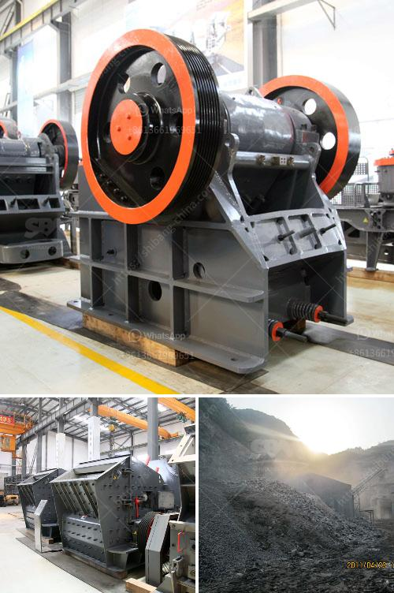

<h3>concrete crusher for rent in toronto</h3>
If you’re in the construction industry, one of the most effective ways to save money is by investing in compact concrete crushers for rent in Toronto. These crushers are highly efficient and versatile, allowing you to crush and recycle various materials on-site. Whether you’re demolishing a building or simply clearing out driveway debris, a concrete crusher rental could be a perfect solution.

One of the biggest advantages of renting a concrete crusher is the affordability. The rental options for these machines are relatively inexpensive compared to buying new or used. Furthermore, renting allows you to avoid the upfront costs of maintenance and storage facilities. Instead, you can simply rent the equipment for the specific duration of your project and return it once you’re done.

Another key benefit of a concrete crusher rental is the portability factor. Since these machines can be easily transported, it allows you to take the crusher to various locations on your site or to different job sites. By doing so, you can maximize efficiency and productivity, minimizing downtime and unnecessary transportation costs.

A concrete crusher rental also gives you the option of using different attachments based on the task at hand. A fixed crusher attachment is versatile enough to break down materials such as concrete, asphalt, stone, and rocks. On the other hand, a rotating crusher attachment allows for greater precision when breaking down materials. These attachments can easily be swapped out depending on the specific requirements of your project.

Moreover, using a concrete crusher rental not only helps you save money but also contributes to environmental conservation. By recycling construction materials on-site, you reduce the need for new aggregate, which is often mined from natural resources. This not only saves energy but also reduces carbon emissions and minimizes the environmental impact of your project. Additionally, renting a concrete crusher helps to minimize waste disposal costs, as the crushed materials can be reused as a base or sub-base for future projects.

When considering a concrete crusher rental in Toronto, it’s essential to choose a reputable rental company. Look for a company with a proven track record in the industry, as well as a wide range of equipment options to suit your specific needs. Additionally, check for reliable customer reviews and testimonials to ensure high-quality service.

In conclusion, renting a concrete crusher in Toronto provides numerous benefits for construction industry professionals. With affordable rental options, portability, and versatile attachments, a concrete crusher rental allows for efficient crushing and recycling of various materials. Furthermore, it helps to minimize waste disposal costs and contributes to environmental sustainability. Therefore, if you have a construction project in Toronto, consider renting a concrete crusher to save money and time while promoting a greener approach to construction.
<h3>Contact us</h3><ul><li><strong>Whatsapp:&nbsp;<a href="https://wa.me/8613661969651">+8613661969651</a></strong></li><li><a href="https://swt.shibang-china.com/?git&amp;zhl&amp;concrete crusher for rent in toronto"><strong>Online Service(chat now)</strong></a></li></ul><h3>Related</h3><ul><li><a href='europe quartz stone machinery factory.md'>europe quartz stone machinery factory</a></li><li><a href='hammer mill machine south africa.md'>hammer mill machine south africa</a></li><li><a href='buy quarry crusher machine from turkey.md'>buy quarry crusher machine from turkey</a></li><li><a href='financial statements of miningpanies.md'>financial statements of miningpanies</a></li><li><a href='china clay processing plant.md'>china clay processing plant</a></li></ul>