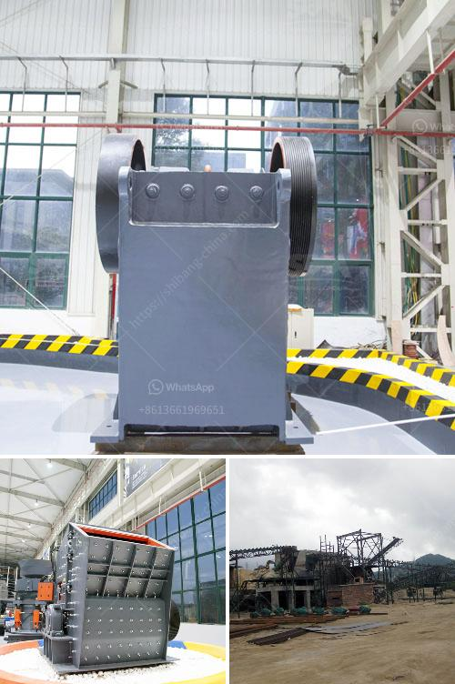

<h3>concrete crusher for rent michigan</h3>
A concrete crusher is a machine that uses mechanical force to break down large blocks of concrete into smaller pieces. Crushers are often used to reduce the size of large rocks and stones into more manageable materials. Crushers are typically used in construction sites, demolition sites, and mining industries to crush stones, rocks, and building materials.

Renting a concrete crusher in Michigan can be an effective way to complete your construction project. By renting a crusher, you can ensure that your project stays on schedule and within budget. Crushers are also a cost-effective solution for many businesses, as renting a crusher eliminates the need for costly transportation and disposal expenses. Furthermore, renting a crusher allows you to recycle concrete on-site, reducing environmental impact and promoting sustainability.

There are several types of concrete crushers available for rent in Michigan, including cone crushers, jaw crushers, and impact crushers. These crushers are all durable and strong enough to handle various types of materials, including reinforced concrete. Whether it is for breaking down demolition debris or crushing materials for recycling purposes, a concrete crusher for rent in Michigan can help significantly increase productivity.

One of the key benefits of renting a concrete crusher in Michigan is its ability to crush concrete blocks on-site. By crushing the concrete right at the construction site, you can save on transportation costs and reduce the amount of material that ends up in landfills. Renting a crusher also eliminates the need to purchase new aggregate materials, as you can use the crushed concrete as a substitute for new materials in your project.

When selecting a concrete crusher for rent in Michigan, it is essential to consider its size, weight, and power requirements. The crusher should be able to handle the size and weight of the materials you need to crush. Additionally, ensure that the crusher has enough power to handle your specific needs. It is also essential to consider the ease of operation and maintenance of the crusher.

Renting a concrete crusher in Michigan is a straightforward process. You can typically rent a crusher from a local equipment rental company or contractor. They will guide you through the rental process, provide you with the necessary equipment, and ensure that the crusher is properly maintained and serviced during the rental period.

In conclusion, renting a concrete crusher in Michigan can provide numerous benefits for your construction project. It allows you to crush concrete blocks on-site, reducing transportation costs and promoting sustainability. Renting a crusher also eliminates the need to purchase new aggregate materials, saving you money. By renting a concrete crusher, you can ensure that your project stays on schedule and within budget. So, consider renting a concrete crusher for your next construction project in Michigan and experience the many benefits it offers.
<h3>Contact us</h3><ul><li><strong>Whatsapp:&nbsp;<a href="https://wa.me/8613661969651">+8613661969651</a></strong></li><li><a href="https://swt.shibang-china.com/?git&amp;zhl&amp;concrete crusher for rent michigan"><strong>Online Service(chat now)</strong></a></li></ul><h3>Related</h3><ul><li><a href='manufacturers crushing stone.md'>manufacturers crushing stone</a></li><li><a href='iron ore crushing and screening.md'>iron ore crushing and screening</a></li><li><a href='marble mining equipments.md'>marble mining equipments</a></li><li><a href='vrm vertical roller mill.md'>vrm vertical roller mill</a></li><li><a href='portable gold mining plant pdf.md'>portable gold mining plant pdf</a></li></ul>