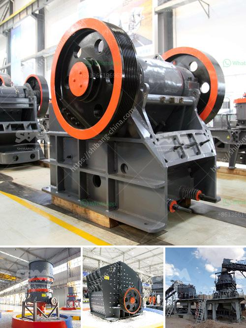

<h3>concrete crusher kenya</h3>
Concrete remains the most widely used construction material globally, renowned for its durability, versatility, and cost-effectiveness. However, during building demolition or renovation projects, the disposal of concrete waste becomes a daunting task, often posing significant environmental concerns. That is where concrete crushers come into play, providing an effective solution to recycle and reuse concrete waste in a cost-effective manner.

Kenya, a rapidly developing country in East Africa, is witnessing a surge in construction activities. With this increased construction, the need for efficient concrete waste management has also become crucial. Concrete crushers in Kenya have proven to be a reliable and efficient solution for concrete recycling.

Concrete crusher machines in Kenya feature high crushing efficiency, low energy consumption, and easy operation. The compact size makes it perfect for small spaces and construction sites. These crushers are equipped with a built-in separator, which ensures the separation of reinforcing steel from the crushed concrete. This greatly simplifies the recycling process and reduces the need for additional equipment.

By recycling concrete waste through crushers, Kenya can reduce the environmental impact caused by the disposal of concrete debris. The recycled material can be used as a base material for new construction projects, reducing the need for virgin aggregates and preserving natural resources. Additionally, using recycled concrete can save costs compared to using new materials, making it an economically viable option for construction companies and individuals alike.

Concrete crusher Kenya offers a highly efficient way to tackle concrete waste, providing a sustainable solution that aligns with the country's commitment to environmental conservation. Furthermore, the use of these crushers ensures compliance with local regulations on waste management and promotes responsible construction practices.

In conclusion, concrete crusher Kenya offers an effective and affordable solution to the challenges posed by concrete waste management. By recycling and reusing concrete, we can reduce the strain on natural resources, minimize environmental impact, and contribute to a sustainable construction industry. With the increasing demand for construction in Kenya, it is essential to adopt efficient concrete waste management practices, and concrete crushers provide the perfect tool for achieving this goal.
<h3>Contact us</h3><ul><li><strong>Whatsapp:&nbsp;<a href="https://wa.me/8613661969651">+8613661969651</a></strong></li><li><a href="https://swt.shibang-china.com/?git&amp;zhl&amp;concrete crusher kenya"><strong>Online Service(chat now)</strong></a></li></ul><h3>Related</h3><ul><li><a href='cement plant equipment china.md'>cement plant equipment china</a></li><li><a href='quarry crusher machine equipment in germany prices.md'>quarry crusher machine equipment in germany prices</a></li><li><a href='mining companies that sell heavy equipment.md'>mining companies that sell heavy equipment</a></li><li><a href='china clay processing plant.md'>china clay processing plant</a></li><li><a href='beneficiation small scale tin ore processing plant.md'>beneficiation small scale tin ore processing plant</a></li></ul>