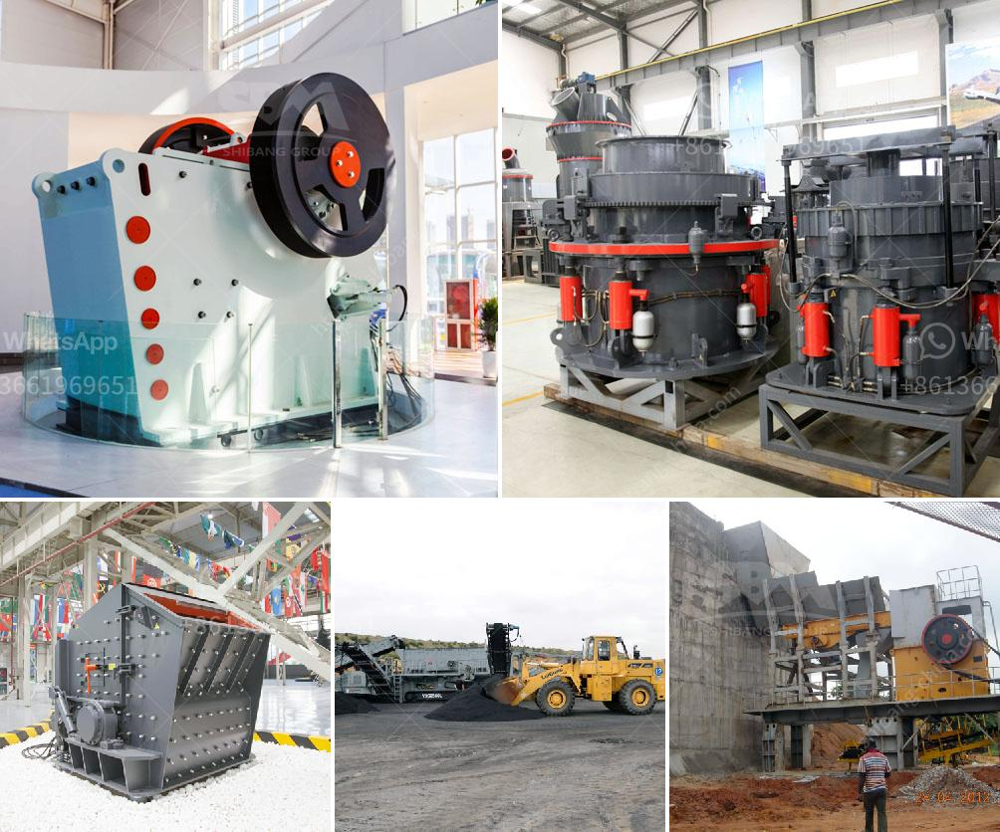

<h3>concrete crushing machine price in china</h3>
The price of concrete crushing machine in China is influenced by various factors, such as equipment model, configuration, manufacturer, and market demand. As the leading manufacturer of crushing and screening equipment in China, the Machinery has witnessed rapid development in the infrastructure construction in recent years. The concrete crushing machine is one of the most popular available options in the market and is widely used in mining, construction, and metallurgy industries.

The concrete crushing machine is highly efficient and energy-saving. It is powered by a diesel engine, which has low fuel consumption and low noise. The machine adopts a unique "rock-on-rock" crushing and grinding technique, which not only improves the crushing efficiency but also extends the service life of vulnerable parts. The concrete crushing machine can crush large blocks, demolished concrete, bricks, asphalt, and stone materials into desired size for reusing or further processing.

In China, there are many manufacturers and suppliers of concrete crushing machines, such as Shanghai Machinery Co., Ltd., Henan Mining Machinery Co., Ltd., and others. These manufacturers offer different types and models of crushing machines with various specifications and functions, catering to the diverse needs of customers. The price range of concrete crushing machines varies significantly depending on the configuration, capacity, and equipment accessories. Generally, the prices of smaller machines are lower, while larger ones with higher capacity are more expensive.

Apart from the price of the concrete crushing machine itself, customers should also consider the after-sales service provided by the manufacturer. The renowned manufacturers always attach great importance to after-sales service, including installation, maintenance, and equipment training. They have a professional team to provide timely and efficient technical support to customers. Additionally, the availability of spare parts plays a crucial role in choosing a concrete crushing machine. It is recommended to select a machine from a manufacturer with a sound supply chain and abundant spare parts to ensure quick and reliable maintenance.

In recent years, the demand for concrete crushing machines has been increasing due to the rapid development of the construction industry in China. The Chinese government has been investing heavily in infrastructure projects, such as high-speed railways, highways, and airports, which requires a large amount of quality concrete aggregates. Therefore, the market demand for concrete crushing machines remains strong, which promotes technological innovation and product improvement.

In conclusion, the price of concrete crushing machine in China is influenced by various factors, such as equipment model, configuration, manufacturer, and market demand. Customers should carefully consider their specific needs and budget when purchasing a concrete crushing machine. It is recommended to choose a reliable manufacturer with good after-sales service and abundant spare parts. With the continuous development of infrastructure construction in China, the market demand for concrete crushing machines will continue to grow.
<h3>Contact us</h3><ul><li><strong>Whatsapp:&nbsp;<a href="https://wa.me/8613661969651">+8613661969651</a></strong></li><li><a href="https://swt.shibang-china.com/?git&amp;zhl&amp;concrete crushing machine price in china"><strong>Online Service(chat now)</strong></a></li></ul><h3>Related</h3><ul><li><a href='quartz stone crusher.md'>quartz stone crusher</a></li><li><a href='100 tph stone crusher plant specifications.md'>100 tph stone crusher plant specifications</a></li><li><a href='factory price tile adhesive manufacturing plant.md'>factory price tile adhesive manufacturing plant</a></li><li><a href='crusher plant supplier in srilanka.md'>crusher plant supplier in srilanka</a></li><li><a href='mobile crushers concrete aggregate.md'>mobile crushers concrete aggregate</a></li></ul>