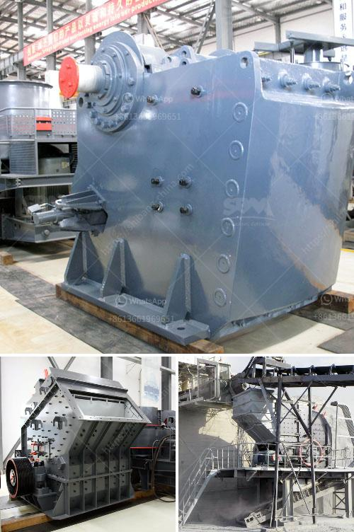

<h3>concrete mobile crusher for rent in usa</h3>
Concrete mobile crusher for rent in USA is a popular crushing equipment in the mining industry. It is widely used in ore, coal, rock, construction, recycling and other fields. In addition to the excellent performance, the concrete mobile crusher also has many advantages such as short cycle time, high production capacity, and low maintenance cost. It can be used for various types of materials, including concrete, gravel, asphalt, and limestone.

The concrete mobile crusher is a piece of heavy equipment that can crush materials of various sizes and hardness levels. Whether it is waste concrete, broken asphalt or other demolition debris, it can be easily recycled and reused. This provides an efficient and environmentally friendly solution for contractors and construction companies.

One of the main advantages of the concrete mobile crusher is its flexibility. It can be easily transported to different job sites, making it suitable for both small and large projects. The mobility of the crusher allows contractors to crush materials on-site, reducing transportation costs and eliminating the need for additional equipment. With its compact design, it can maneuver through narrow spaces and access hard-to-reach areas.

The concrete mobile crusher is also equipped with advanced safety features such as handrails, guards, and emergency stop buttons to ensure the safety of operators. It has a user-friendly control panel that allows operators to easily adjust the settings and monitor the crushing process. The crusher is also equipped with a powerful engine that provides sufficient power to handle heavy loads and ensures efficient crushing.

Renting a concrete mobile crusher in the USA is a cost-effective option for contractors and construction companies. It provides the flexibility to crush materials on-site and eliminate transportation costs. Renting also allows companies to try out different models and sizes before making a purchase decision. The rental service usually includes delivery, setup, and maintenance, which saves time and resources for the customer.

Before renting a concrete mobile crusher, it is important to consider the specific requirements of the project. Factors such as material type, desired output size, and production capacity should be taken into account. The rental company can provide advice and guidance on choosing the right crusher for the job.

In conclusion, the concrete mobile crusher for rent in the USA offers numerous benefits for contractors and construction companies. It provides the flexibility to crush materials on-site, reduces transportation costs, and is environmentally friendly. With its advanced safety features and user-friendly controls, it is a reliable and efficient crushing equipment. Renting a concrete mobile crusher is a cost-effective option that allows companies to try out different models and sizes. Overall, it is an excellent solution for the crushing and recycling needs of the mining industry.
<h3>Contact us</h3><ul><li><strong>Whatsapp:&nbsp;<a href="https://wa.me/8613661969651">+8613661969651</a></strong></li><li><a href="https://swt.shibang-china.com/?git&amp;zhl&amp;concrete mobile crusher for rent in usa"><strong>Online Service(chat now)</strong></a></li></ul><h3>Related</h3><ul><li><a href='to buy gypsum calcination rotary kiln plant.md'>to buy gypsum calcination rotary kiln plant</a></li><li><a href='stone crusher for sale in south africa.md'>stone crusher for sale in south africa</a></li><li><a href='shafts for hammer mills.md'>shafts for hammer mills</a></li><li><a href='sand making plant in nepal.md'>sand making plant in nepal</a></li><li><a href='iron ore vibrator screen.md'>iron ore vibrator screen</a></li></ul>