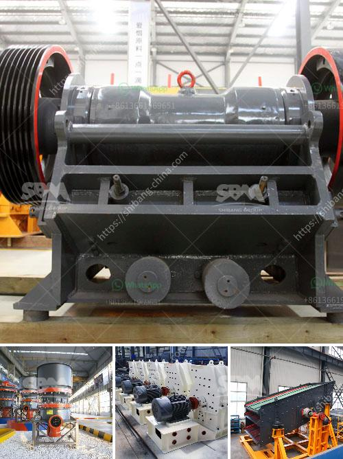

<h3>concrete plants for sale in spain</h3>
Concrete plants are essential for construction projects, providing the necessary concrete mix to build strong and durable structures. In Spain, the demand for concrete plants has been steadily increasing as the construction industry continues to thrive. Consequently, there are numerous concrete plants for sale available in the Spanish market.

Spain is well known for its architectural wonders, from historic monuments to modern skyscrapers. Many of these impressive structures were made possible by the use of high-quality concrete produced by reliable concrete plants. As construction projects continue to flourish throughout the country, the need for efficient and reliable concrete plants has become paramount.

Concrete plants for sale in Spain offer a wide range of options to cater to different project requirements. These plants consist of various components, including cement storage silos, aggregate storage bins, conveyor belts, weighing systems, mixers, and control panels. Each component plays a vital role in the production process, ensuring that the concrete mix is of superior quality and meets specific project specifications.

One of the key factors to consider when purchasing a concrete plant is its production capacity. The capacity of a concrete plant determines the quantity of concrete it can produce per hour or day. This is crucial as it directly correlates with the efficiency and effectiveness of a construction project. Moreover, a plant with a larger production capacity can accommodate larger construction projects, leading to increased revenues.

The type of concrete plant you choose also matters. Fixed central concrete plants are commonly used for large-scale construction projects that require a steady supply of concrete. These plants are characterized by their permanently installed foundation and are designed for high productivity. On the other hand, mobile concrete plants offer greater flexibility as they can be easily transported to different sites. These plants are ideal for smaller-scale projects or those in remote areas.

When searching for concrete plants for sale in Spain, it is essential to consider the reputation and reliability of the manufacturer or supplier. A reputable manufacturer will ensure that their plants are built using high-quality materials and meet international standards. Additionally, they will provide comprehensive after-sales support, including installation, training, and maintenance services.

Another important consideration is the cost of the concrete plant. Prices vary depending on the capacity, brand, and additional features of the plant. While it is tempting to opt for cheaper options, it is crucial to strike a balance between price and quality. Investing in a high-quality concrete plant may incur a higher upfront cost but can yield significant long-term benefits, including improved productivity, efficiency, and durability.

In conclusion, the availability of concrete plants for sale in Spain is a testament to the booming construction industry. Whether you are embarking on a large-scale project or a smaller endeavor, there are various concrete plants to suit your needs. It is essential to consider factors such as production capacity, type of plant, reputation of the manufacturer, and cost when making a purchase. By choosing the right concrete plant, you can ensure a steady and reliable supply of high-quality concrete to support your construction projects in Spain.
<h3>Contact us</h3><ul><li><strong>Whatsapp:&nbsp;<a href="https://wa.me/8613661969651">+8613661969651</a></strong></li><li><a href="https://swt.shibang-china.com/?git&amp;zhl&amp;concrete plants for sale in spain"><strong>Online Service(chat now)</strong></a></li></ul><h3>Related</h3><ul><li><a href='crush plant prices in pakistan.md'>crush plant prices in pakistan</a></li><li><a href='crusher china jaw crusher cost.md'>crusher china jaw crusher cost</a></li><li><a href='pe series jaw crusher and ton per day.md'>pe series jaw crusher and ton per day</a></li><li><a href='type of quarry crusher equipment.md'>type of quarry crusher equipment</a></li><li><a href='project cost of mini cement plant in india.md'>project cost of mini cement plant in india</a></li></ul>