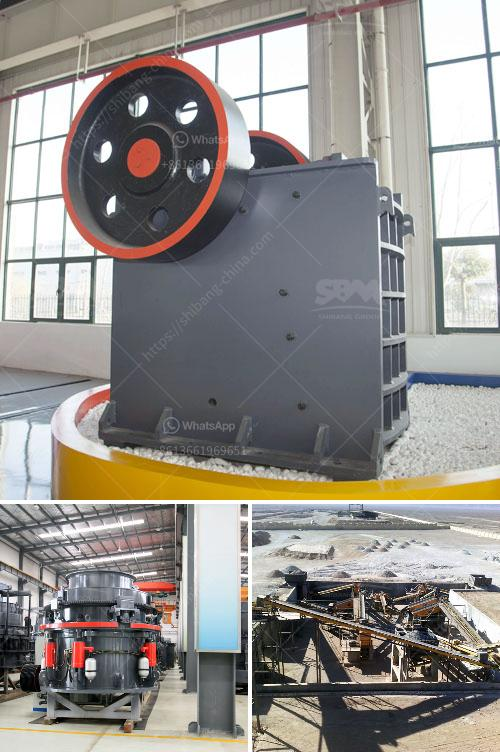

<h3>concrete stone crusher uk for sale</h3>
Concrete stone crushers are a type of pulverization equipment used in the crushing, or breaking into very fine particles, of concrete into smaller, more manageable pieces. It is a must-have machine in today's construction industry, especially for concrete structures such as bridges, tunnels, and buildings.

In concrete aggregate processing line, the work of the portable concrete crusher for sale is crushing. The aggregate produced by crusher machine can be used to produce concrete, brick and so on; the mortar can be used to lay block and wallboard, etc; the stone screened by construction waste can be used to pave road and so on.

The development of the concrete aggregate processing industry has also promoted the development of wall materials and other industries. Working Principle of Concrete Crushing Machine:

The motor drives the rotor, which discharges particles at high speed through the upper feed inlet. The material is fed into the crushing chamber from the upper feed inlet, with the help of the centrifugal force of the rotor, the material is crushed by the impact of the hammer rotating at a high speed, and then thrown to the counterattack plate installed above the rotor for secondary crushing. Then rebounded to the hammer action area to be crushed again. This process is repeated until the material meets the set particle size and falls into the discharge outlet of the lower part of the crusher.

As the market demand for aggregate increases continuously, the customer's requirements for the stone crusher are also increasing. This has made the stone crusher machines more focused on the wear parts in the market. People pay more and more attention to the wear parts of the stone crusher. The quality of the wear parts determines the service life and working efficiency of the crusher. For this reason, high-quality wear parts are necessary for the crusher. Nowadays, we carry out the improvement of the crusher from the parts, called the wear parts.

Concrete stone crusher UK for sale is the main equipment in the whole production line. The wide application of the commercial concrete has become more and more popular in construction industry, thus the development of the sand making industry has also been promoted. The concrete crushing machines can be easily found in nowadays industries.

Facing various sandstone aggregates, industrial bricks, and other concrete waste, the machine-made sand produced by the concrete waste crusher has a particle size equal to and even better than that of natural sand, so that concrete aggregate can be widely used in the construction site. Compared to the sandstone that makes up the mountain, sand, and gravel from riverbeds, and even seashore sand, the machine-made sand is becoming a new substitute for them.

In conclusion, the concrete stone crusher UK for sale is composed of a rotor, bearing, counterattack plate, hammer, and other parts. It is mainly used in industries such as cement, coal separation, electricity generation, construction materials, and compound fertilizer. The concrete crusher machine has the characteristics of small size, large crushing ratio, low noise, simple structure, convenient maintenance and high efficiency.
<h3>Contact us</h3><ul><li><strong>Whatsapp:&nbsp;<a href="https://wa.me/8613661969651">+8613661969651</a></strong></li><li><a href="https://swt.shibang-china.com/?git&amp;zhl&amp;concrete stone crusher uk for sale"><strong>Online Service(chat now)</strong></a></li></ul><h3>Related</h3><ul><li><a href='industrial roller ball mill.md'>industrial roller ball mill</a></li><li><a href='latest three roll mills.md'>latest three roll mills</a></li><li><a href='cement plant layout consultants in south africa.md'>cement plant layout consultants in south africa</a></li><li><a href='how much is gold hammer mill crusher.md'>how much is gold hammer mill crusher</a></li><li><a href='crushing conveyor belts malaysia.md'>crushing conveyor belts malaysia</a></li></ul>