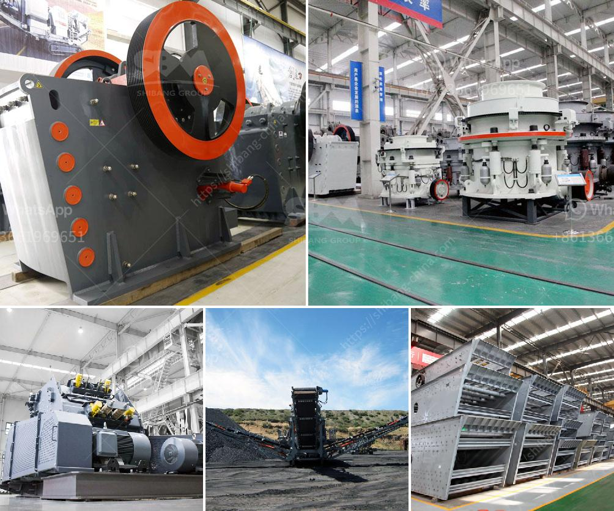

<h3>concrete waste crushing and iron</h3>
Concrete waste crushing and iron separation equipment are necessary for the construction industry, especially for the steel-intensive industries where the use of iron and steel products accounts for a high proportion, such as highways, railways, bridges, and buildings. With the acceleration of urbanization, the generation of a large amount of construction waste has become a pressing issue. Therefore, the efficient recycling of concrete waste has become an important means to ease environmental pressure and promote sustainable development.

Concrete waste mainly refers to the waste concrete, bricks, and other wastes generated during the construction, demolition, and renovation of buildings. It is worth mentioning that concrete waste accounts for a considerable proportion in construction waste. Crushing and iron separation equipment are essential in the process of recycling of construction waste. Crushing is the first step of recycling, accompanied by iron removal and screening, which can separate and extract steel bars efficiently. The primary crusher breaks the concrete into large pieces, after which the iron separator separates the steel from the concrete. Lastly, the crusher and iron separator screen the final crushed product, which can be precisely classified into different sizes according to the customer's requirements.

The iron separator is an essential equipment in the concrete recycling process. It can separate the steel bars inside the concrete and prevent them from damaging the crushers. Iron separation can also efficiently reduce construction waste and environmental pollution. After the iron is separated, the remaining concrete waste can be crushed again to obtain higher-quality recycled aggregates. The recycled concrete aggregates can be used as filling materials, subgrade materials, roadbed materials, recycled bricks and blocks, and recycled concrete products. The application of recycled concrete aggregates can effectively conserve natural resources, reduce environmental pollution, and promote sustainable development.

Concrete waste crushing and iron separation equipment are widely used in concrete recycling projects. Concrete waste crushing is the initial step of concrete recycling, with the primary purpose of breaking the large chunks of concretes into smaller pieces that can be treated with subsequent iron separation. The crushing process usually includes a jaw crusher, cone crusher, and impact crusher. Iron separation is generally performed by a magnetic separator. Various types of magnetic separators can be selected according to the different properties of the iron-containing materials.

In summary, concrete waste crushing and iron separation equipment are necessary in concrete recycling. The efficiency, mobility, and economic benefits of crushing concrete waste into recycled aggregates instead of dumping them in landfills are well-known in the construction industry. These recycled concrete aggregates can replace the natural aggregates used in a wide range of construction applications, effectively reducing construction costs and environmental pollution. The use of iron separation equipment can separate and extract steel bars efficiently, ensuring the quality of recycled aggregates and facilitating the recycling process. The concrete waste crushing and iron separation equipment also play an important role in the advancement of resource recycling and sustainable development.
<h3>Contact us</h3><ul><li><strong>Whatsapp:&nbsp;<a href="https://wa.me/8613661969651">+8613661969651</a></strong></li><li><a href="https://swt.shibang-china.com/?git&amp;zhl&amp;concrete waste crushing and iron"><strong>Online Service(chat now)</strong></a></li></ul><h3>Related</h3><ul><li><a href='mobile gold crusher plant.md'>mobile gold crusher plant</a></li><li><a href='cone crushers to rent south africa.md'>cone crushers to rent south africa</a></li><li><a href='quarry crusher price.md'>quarry crusher price</a></li><li><a href='trommel wash plant suppliers pakistan.md'>trommel wash plant suppliers pakistan</a></li><li><a href='static jaw crusher.md'>static jaw crusher</a></li></ul>