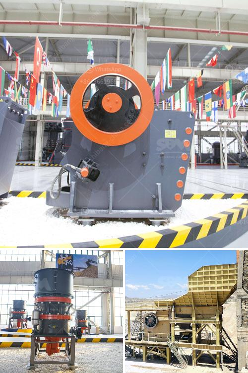

<h3>cone crusher device</h3>
The cone crusher is a crushing machine that utilizes the principle of bending and squeezing to crushing the material. Its unique design structure enables it to crush materials of different sizes and hardness levels. The crushing mechanism consists of an eccentric shaft, a movable cone, a fixed cone, an adjusting sleeve, and a hydraulic system.

The cone crusher is widely used in mining, smelting, building materials, roads, railways, water conservancy, and chemical industries. It has a large crushing ratio, high efficiency, low energy consumption, and uniform product particle size. It is suitable for crushing various ores and rocks with medium and medium-hardness.

One of the main advantages of the cone crusher is its versatility. With multiple cavity types, it can be used for coarse crushing, medium crushing, and fine crushing, catering to different application needs. Additionally, the hydraulic system can quickly adjust the discharge port to control the size of the product.

The cone crusher is also known for its simple structure, stable operation, easy maintenance, and high crushing efficiency. In addition, it can be applied to various industries, such as mining, metallurgy, and building materials.

With the continuous development of mining technology and increased demand for crushing equipment, manufacturers have introduced advanced cone crushers that are more efficient and productive. These include hydraulic cone crushers and multi-cylinder cone crushers.

In conclusion, the cone crusher is an essential crushing device in the mining industry, offering many benefits such as large crushing ratio, high efficiency, easy operation, and low maintenance. It plays a vital role in improving the overall productivity and profitability of a company.
<h3>Contact us</h3><ul><li><strong>Whatsapp:&nbsp;<a href="https://wa.me/8613661969651">+8613661969651</a></strong></li><li><a href="https://swt.shibang-china.com/?git&amp;zhl&amp;cone crusher device"><strong>Online Service(chat now)</strong></a></li></ul><h3>Related</h3><ul><li><a href='europe quartz stone machinery factory.md'>europe quartz stone machinery factory</a></li><li><a href='concrete stone crusher uk for sale.md'>concrete stone crusher uk for sale</a></li><li><a href='grinding machine for marble.md'>grinding machine for marble</a></li><li><a href='price of ball mill in india.md'>price of ball mill in india</a></li><li><a href='type of quarry crusher equipment.md'>type of quarry crusher equipment</a></li></ul>