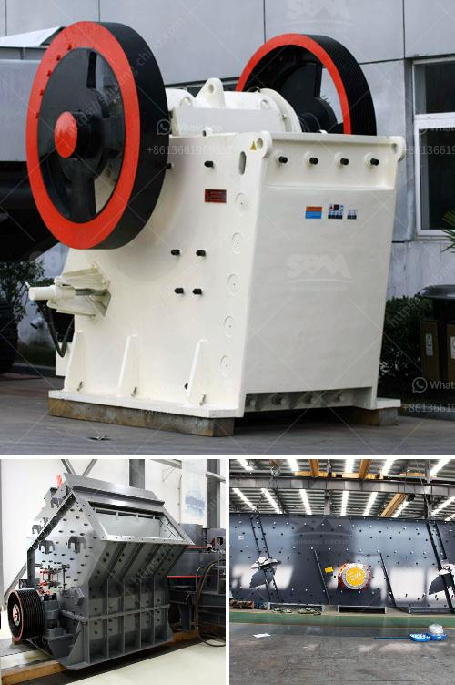

<h3>cone crusher for sale in philippines</h3>
Are you in the market for a cone crusher in the Philippines? If you want to go all-in on a high-performing crusher that can enhance your crushing operations overall, then choosing a cone crusher may be the right option for you. Also known as a gyratory crusher, this machine produces a more uniform output size compared to jaw crushers.

A cone crusher operates on a vertical axis and crushes rocks by squeezing them between a mantle and a concave. It is often used in the secondary and tertiary crushing stages, and is effective in reducing medium to hard and abrasive materials, such as granite, basalt, gabbro, river gravel, and limestone.

One of the advantages of a cone crusher is its ability to provide a high reduction ratio, which allows for a superior end product shape and quality. Additionally, it has a compact design, making it suitable for both fixed and mobile applications. Whether you are expanding your quarry or need a crusher for your mining operation, a cone crusher can meet your specifications.

When it comes to purchasing a cone crusher in the Philippines, you have a few different options that cater to different budgets. The price range starts at around $18,000 and goes up to $500,000 or more. When choosing the right cone crusher for your needs, it's important to consider factors such as capacity, power requirements, and extraordinary features that may be specific to your industry.

Whether you are in the quarrying, mining, or construction industry, investing in a cone crusher for sale in the Philippines is a smart move. You'll be able to boost production rates while minimizing operating costs. Start browsing the wide selection of cone crushers available in the market and select the one that suits your needs and budget perfectly.
<h3>Contact us</h3><ul><li><strong>Whatsapp:&nbsp;<a href="https://wa.me/8613661969651">+8613661969651</a></strong></li><li><a href="https://swt.shibang-china.com/?git&amp;zhl&amp;cone crusher for sale in philippines"><strong>Online Service(chat now)</strong></a></li></ul><h3>Related</h3><ul><li><a href='coal mining machines in india.md'>coal mining machines in india</a></li><li><a href='business plan for coal processing.md'>business plan for coal processing</a></li><li><a href='silica sand production using ball mill in dubai.md'>silica sand production using ball mill in dubai</a></li><li><a href='pe 600 900 primary jaw crusher.md'>pe 600 900 primary jaw crusher</a></li><li><a href='200tpd gold processing plant.md'>200tpd gold processing plant</a></li></ul>