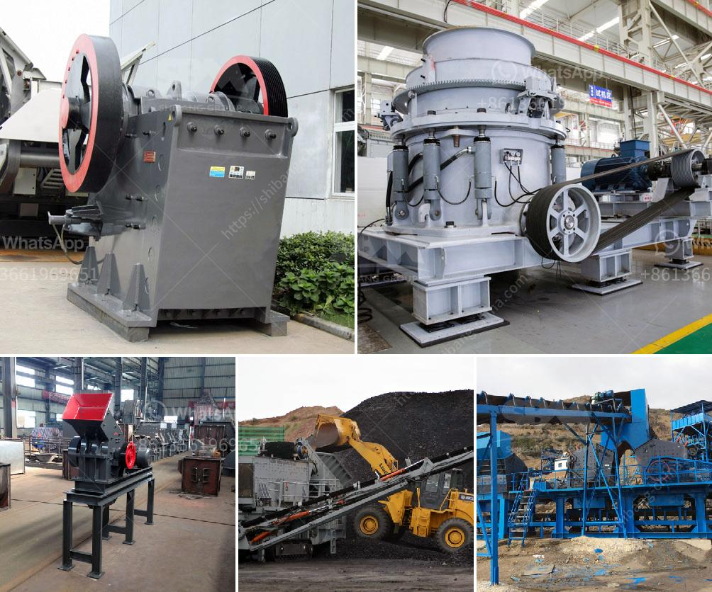

<h3>cone crusher for sale nigeria</h3>
A cone crusher is a type of crushing machine that has been widely used in mining and construction for decades. It is designed based on the principle of laminating crushing and crushing more and wearing less. Compared with traditional crushers, the cone crusher for sale Nigeria has the advantages of reliable structure, high efficiency, easy adjustment and convenient operation.

The cone crusher for sale in Nigeria produced by SBM consists of frame, transmission device, hollow eccentric shaft, bowl-shaped bearing, crushing cone, springs and hydraulic pressure station for adjusting discharge opening. During the operation, the motor drives the eccentric shaft shells to turn around through a horizontal axle and a pair of bevel gear. The axle of crushing cone swings with the force of eccentric shaft shell so that the surface of the crushing wall is close to the roll mortar wall from time to time. Then the ores will be impacted, squeezed and bent constantly in the crushing chamber. At last, the whole ore crushing process is finished.

The cone crusher for sale in Nigeria is composed of feed and discharge opening, cylinder, cone, gears, transmission shaft, pinion, motor, and other parts. Through the horizontal axis and a pair of bevel gear, the motor drives the eccentric sleeve bushing to rotate, which makes the cone crushing cone axis to swing. The crushing cone is sometimes close to and sometimes away from the fixed cone to complete the crushing and nesting.

The cone crusher for sale Nigeria, also termed as the fine crusher, can be used in producing fine aggregates for building sand and chippings. The cone crusher is often used in the secondary or tertiary crushing process along with the jaw crushers and impact crushers. The cone crusher for sale Nigeria sometimes uses a vertical axis detector for tramp material, which ensures the equipment operates continuously and stably, even under heavy load conditions.

For customers in Nigeria who are interested in cone crushers, there are many options for your selection. SBM is a professional manufacturer and supplier of cone crushers. Throughout our years of operation, we have built a wealth of experience in designing and manufacturing various types of cone crushers. We also offer customized solutions to meet specific customer requirements.

In conclusion, the cone crusher for sale in Nigeria is a kind of efficient and energy-saving crushing equipment. It is a multifunctional equipment that can be used for processing various minerals, such as gold, coal, bauxite, copper, limestone, etc. It has the characteristics of reliable structure, high production efficiency, convenient adjustment, and economical use. If you have any questions or requirements about cone crushers for sale in Nigeria, please feel free to contact us. Our professional team will provide you prompt and efficient service.
<h3>Contact us</h3><ul><li><strong>Whatsapp:&nbsp;<a href="https://wa.me/8613661969651">+8613661969651</a></strong></li><li><a href="https://swt.shibang-china.com/?git&amp;zhl&amp;cone crusher for sale nigeria"><strong>Online Service(chat now)</strong></a></li></ul><h3>Related</h3><ul><li><a href='crushers price in south africa product.md'>crushers price in south africa product</a></li><li><a href='advantages and disadvantages of a roll crusher.md'>advantages and disadvantages of a roll crusher</a></li><li><a href='marble powder plant.md'>marble powder plant</a></li><li><a href='conveyor belts for sand for sale.md'>conveyor belts for sand for sale</a></li><li><a href='mobile crushers concrete aggregate.md'>mobile crushers concrete aggregate</a></li></ul>