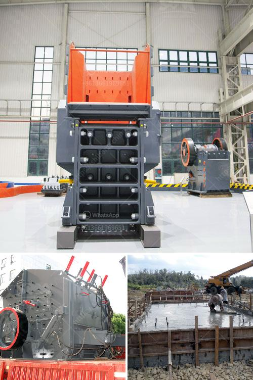

<h3>cone crusher from china</h3>
Based on the traditional technology and combined with the advanced technology from abroad, the cone crusher from China adopts quite a few innovative designs for processing various materials in various industries.

As China's economic development and infrastructure continue to improve, the crusher industry has also developed rapidly. Cone crushers have become one of the most popular crushing equipment in the market because of their high efficiency, low operating costs, and easy maintenance. The cone crusher from China is suitable for both metallic minerals and non-metallic minerals, such as iron ore, nonferrous metal ore, granite, limestone, quartzite, sandstone, pebble, etc.

In the past years, our cone crusher machine have been exported to more than 60 countries, such as Afghanistan, Algeria, Australia, Bangladesh, Brazil, Cambodia, Congo, Egypt, France, India, Indonesia, Ireland, Libya, Mongolia, Nigeria, Oman, Pakistan, Philippines, Russia, Saudi Arabia, Singapore, South Africa, Sri Lanka, Sudan, Syria, Tajikistan, Thailand, Turkey, Uganda, Ukraine, United Arab Emirates, USA, Uzbekistan, Vietnam, Yemen and so on.

The cone rock crusher can crush high-hardness stones such as basalt, granite, river pebble, tuff, volcanic rock and other rocks; while the impact rock crusher can crush low-hardness stones such as limestone and bluestone. After secondary crushing, 1-2/1-3 cm stones can be directly produced.

Fine crushing: Sand making machine. The stones can be further broken into finer particles. The stone making line (sand making line) integrates crushing, sand making, and screening. Together with belt conveyor, vibrating screen and vibrating feeder, cone crusher can form the aggregate sand and gravel production line.

As a leading cone crusher manufacturer in China, GATOR is committed to GCS cone crusher design, manufacturing, and sales. We provide standard cone crushers, cone crushers are suitable to crush the compression resistance less than 350Mpa ores and rocks. Standard Cone Crusher: Cone Crusher has a large feeding size, marker size is coarse, so the standard cone is generally used when rough-broken-in pieces of material are required. Short Head Cone Crusher: Short Head Cone Crusher is steep with small particle size. It is conducive to the production of fine grade materials. The short head type is used to meet the crushing demands of the material broken.

Cone crusher consists of frame, transmission device, hollow eccentric shaft, bowl-shaped bearing, crushing cone, springs and hydraulic pressure station for adjusting discharge opening.

Hongxing Machinery is one of the most famous cone crusher manufacturers in China. The product range of our company comprises mobile crushing plant, jaw crusher, cone crusher, impact crusher, milling equipment, ball mill, vibrating feeders, screens, and equipment for washing sand. Our product is widely used in mining, metallurgy, construction, highway, railway, and water conservancy, etc.
<h3>Contact us</h3><ul><li><strong>Whatsapp:&nbsp;<a href="https://wa.me/8613661969651">+8613661969651</a></strong></li><li><a href="https://swt.shibang-china.com/?git&amp;zhl&amp;cone crusher from china"><strong>Online Service(chat now)</strong></a></li></ul><h3>Related</h3><ul><li><a href='price of plant mobile crusher.md'>price of plant mobile crusher</a></li><li><a href='used stone crushers for sale south africa.md'>used stone crushers for sale south africa</a></li><li><a href='europe stone quarry equipment supplier.md'>europe stone quarry equipment supplier</a></li><li><a href='rencana bisnis perusahaan tambang pdf.md'>rencana bisnis perusahaan tambang pdf</a></li><li><a href='rencana anggaran biaya stone crusher.md'>rencana anggaran biaya stone crusher</a></li></ul>