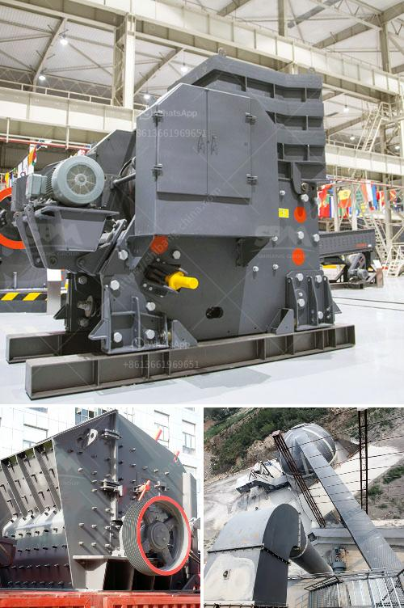

<h3>cone crusher in america</h3>
The cone crusher is a versatile crushing device that can be used in cement, mining, quarrying, and other industries. While the cone crusher is a mechanical device, it is considered to be a "crusher" because it can crush various material of different sizes and shapes. This versatile feature of the cone crusher has made it a popular choice among crushing devices in America.

One of the primary reasons why the cone crusher is widely used in America is its ability to process raw materials efficiently. As an essential component in the mining and construction industry, the cone crusher helps to break down larger rocks into smaller pieces. These smaller pieces are then used for various purposes, such as road construction, building materials, and cement production.

In addition to its efficient processing capabilities, the cone crusher in America is also known for its durability. Operating in harsh environments, such as mines and quarries, the cone crusher is built to withstand challenging conditions. This durability ensures that the cone crusher can perform optimally even under extreme circumstances, resulting in less downtime and increased productivity.

Another advantage of the cone crusher in America is its versatility. With the ability to handle different types of materials, the cone crusher can be used for a wide range of applications. For example, it can crush hard and abrasive rocks, as well as soft and non-abrasive materials. This versatility allows industries in America to use the cone crusher for various projects without the need for multiple crushing devices.

The cone crusher in America is also known for its safety features. With advanced technology and design, the cone crusher is equipped with safety devices that protect both the operator and the machine itself. These safety features include hydraulic control, overload protection, and automatic lubrication. These features ensure the cone crusher operates smoothly and minimizes the risks associated with crushing operations.

Moreover, the cone crusher in America offers several benefits in terms of cost and energy efficiency. Compared to traditional crushing methods, the cone crusher consumes less energy and produces fewer fines. This results in lower operating costs and a reduced environmental impact, making the cone crusher a sustainable choice for businesses in America.

In conclusion, the cone crusher is a valuable tool in America's construction, mining, and quarrying industries. Its versatility, durability, efficiency, and safety features make it a popular choice for crushing operations. Additionally, the cone crusher offers cost-saving and energy-efficient benefits, making it a sustainable and reliable crushing solution.
<h3>Contact us</h3><ul><li><strong>Whatsapp:&nbsp;<a href="https://wa.me/8613661969651">+8613661969651</a></strong></li><li><a href="https://swt.shibang-china.com/?git&amp;zhl&amp;cone crusher in america"><strong>Online Service(chat now)</strong></a></li></ul><h3>Related</h3><ul><li><a href='vertical mill cement.md'>vertical mill cement</a></li><li><a href='ball mill procedure in practical.md'>ball mill procedure in practical</a></li><li><a href='indopol roller grinding mills.md'>indopol roller grinding mills</a></li><li><a href='running sponge iron plant for sale in gujarat.md'>running sponge iron plant for sale in gujarat</a></li><li><a href='full quarry machines for sale in china.md'>full quarry machines for sale in china</a></li></ul>