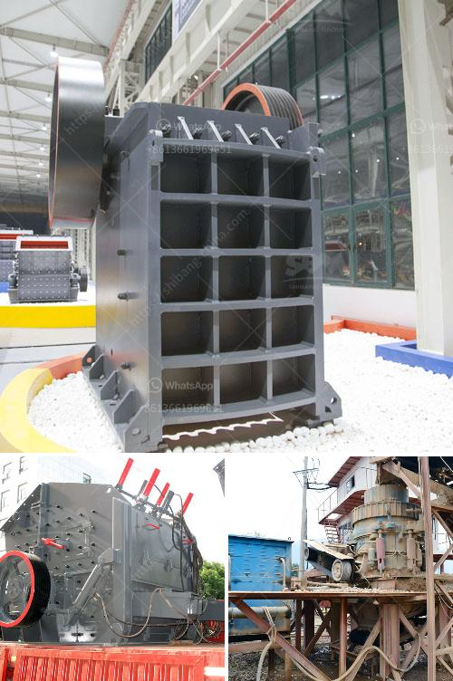

<h3>cone crusher machine for sale</h3>
Cone crusher machine plays an integral part in the stone crushing process. The design and structure of this machine make it efficient and versatile, allowing it to crush a variety of materials, including hard and abrasive rocks, stones, and minerals. This article highlights the key features and benefits of cone crusher machines that are currently available for sale.

Firstly, let's discuss the structure of a typical cone crusher machine. The main components include the frame, the concave mantle, the spring, the eccentric shaft, and the drive system. The frame provides support and stability for the crusher, while the concave mantle is responsible for crushing the material. The spring helps to maintain the gap between the concave mantle and the crushing chamber, ensuring consistent crushing performance. The eccentric shaft, connected to the motor, enables the rotational movement of the mantle, allowing for effective crushing. Lastly, the drive system powers the cone crusher machine, aiding in the crushing process.

One of the major advantages of cone crusher machines is their ability to produce a high-quality end product. The shape and size of the crushed material are important factors in determining the overall quality. Cone crushers are designed to produce a cubical-shaped product, which is desirable for many applications, such as road construction, concrete production, and mining operations. Additionally, these machines have an adjustable discharge opening, allowing operators to control the size of the final product.

Another significant benefit of cone crusher machines is their versatility. They can efficiently crush a wide range of materials, from soft to hard, and from brittle to tough. This versatility makes them suitable for various applications in different industries. For example, cone crushers can be used in the mining industry to reduce the size of ore and facilitate the extraction process. They are also commonly used in the construction industry to crush aggregate materials for concrete production.

In terms of maintenance, cone crusher machines are relatively easy to operate and maintain. Regular inspection and lubrication of the machine's key components, such as the bearings and the concave mantle, can help ensure its optimal performance and prolong its service life. Furthermore, most cone crusher machines are equipped with advanced features that aid in the maintenance process, such as automatic overload protection and hydraulic adjustment systems.

Lastly, let's discuss the availability of cone crusher machines for sale. These machines are commonly available in various sizes and models, allowing buyers to choose the most suitable one for their specific needs. They can be purchased from reputable manufacturers, dealers, or online platforms specializing in heavy machinery and equipment. When selecting a cone crusher machine for sale, it is important to consider factors such as the production capacity, power consumption, and overall reliability of the machine.

In conclusion, cone crusher machines are essential equipment in the stone crushing process. Their efficient design, high-quality end product, versatility, and ease of maintenance make them highly desirable for a variety of applications. With numerous options available on the market, buyers can find the perfect cone crusher machine for their specific requirements.
<h3>Contact us</h3><ul><li><strong>Whatsapp:&nbsp;<a href="https://wa.me/8613661969651">+8613661969651</a></strong></li><li><a href="https://swt.shibang-china.com/?git&amp;zhl&amp;cone crusher machine for sale"><strong>Online Service(chat now)</strong></a></li></ul><h3>Related</h3><ul><li><a href='100 tph stone crusher price.md'>100 tph stone crusher price</a></li><li><a href='mobile rock crushing plant nigeria.md'>mobile rock crushing plant nigeria</a></li><li><a href='advantage of wet grinding in cement manufacturing.md'>advantage of wet grinding in cement manufacturing</a></li><li><a href='mining conveyor belt china.md'>mining conveyor belt china</a></li><li><a href='how to process quartz ore crusher.md'>how to process quartz ore crusher</a></li></ul>