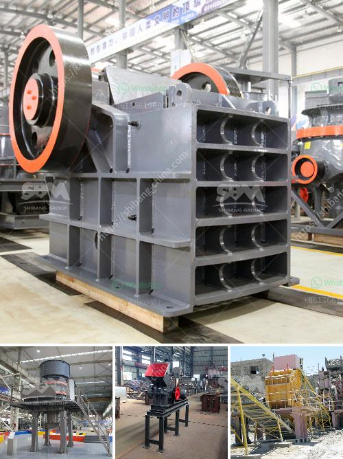

<h3>cone crusher second hand for sale in south africa</h3>
Cone crushers are commonly used for secondary crushing (although impact crushers are sometimes used), which typically reduces material to about 2.5 to 10 centimeters. Cone crushers have been used as primary, secondary and tertiary crushers for quite a long time. They are widely employed for crushing hard and abrasive materials in both the aggregate and mining industries.

Cone crushers are used predominantly for secondary crushing applications, although they can be used for tertiary or quaternary crushing as well. Cone crushers are often used for this purpose because they are able to crush hard rocks with ease. These machines are capable of producing a wide range of particle size distributions, whether the material is a soft or a hard rock.

When it comes to buying a second-hand cone crusher, it is essential to consider productivity, quality, and affordability. The cone crusher market in South Africa is competitive and there are many suppliers selling different types of cone crushers. Some companies have a reputation for being reputable and reliable, while others may not have as good a reputation.

There are many types of cone crushers available, ranging from the simple cone crusher to the more advanced hydraulic cone crusher. It is important to choose a cone crusher that suits your requirements and budget. In terms of size, the smaller cone crushers are usually used for secondary crushing, while the larger ones are suitable for primary or tertiary crushing.

One of the key factors to consider when buying a cone crusher is the shape of the crushing chamber. Different cone crushers have different types of crushing chambers, including standard, medium, and short head chambers. The shape of the chamber affects the capacity, efficiency, and product quality of the crusher. A standard cone crusher has a larger feed opening and a wider discharge opening, which allows for more efficient crushing of larger materials. A short head cone crusher has a smaller feed opening and a narrower discharge opening, which allows for finer crushing of smaller materials.

Another important consideration when buying a second-hand cone crusher is the condition of the machine. It is advisable to inspect the machine thoroughly before purchasing it to ensure that all components are in good working order. This includes checking the engine, hydraulics, electrical system, and overall structural integrity of the machine. It is also important to check for any signs of wear and tear, such as cracks or excessive corrosion.

Overall, there are many factors to consider when buying a cone crusher second hand for sale in South Africa. It is important to choose a reliable supplier who offers high-quality machines at an affordable price. Additionally, it is crucial to thoroughly inspect the machine before purchasing it to ensure that it is in good working condition. By considering these factors, individuals can find a cone crusher that meets their specific requirements and can provide reliable and efficient crushing performance.
<h3>Contact us</h3><ul><li><strong>Whatsapp:&nbsp;<a href="https://wa.me/8613661969651">+8613661969651</a></strong></li><li><a href="https://swt.shibang-china.com/?git&amp;zhl&amp;cone crusher second hand for sale in south africa"><strong>Online Service(chat now)</strong></a></li></ul><h3>Related</h3><ul><li><a href='gold rock crusher plant portable.md'>gold rock crusher plant portable</a></li><li><a href='m sand crusher in tirunelveli.md'>m sand crusher in tirunelveli</a></li><li><a href='hammer mill price philippines.md'>hammer mill price philippines</a></li><li><a href='industrial application ball mill.md'>industrial application ball mill</a></li><li><a href='manufacturer of rotary screen for crushed lime stone.md'>manufacturer of rotary screen for crushed lime stone</a></li></ul>