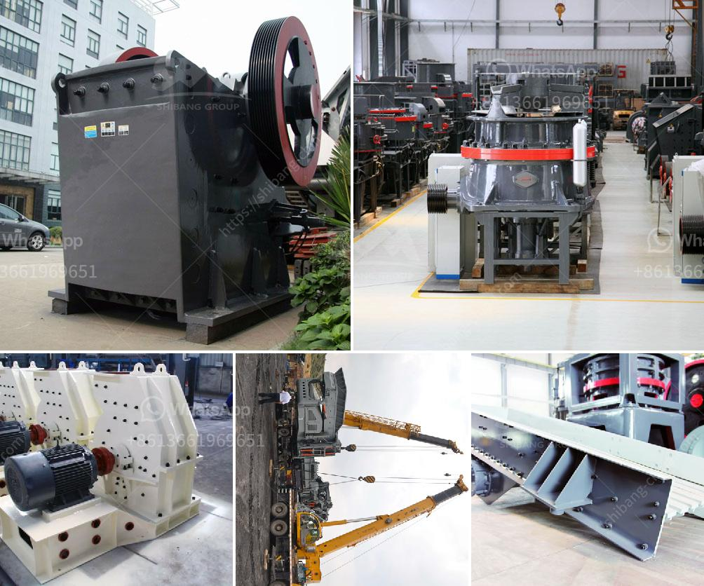

<h3>cone crusher secondary price</h3>
Cone crushers are popular rock crushing machines in aggregates production, mining operations, and recycling applications. They are normally used in secondary, tertiary, and quaternary crushing stages. However, the secondary cone crusher price can vary greatly depending on the manufacturer and model.

One of the factors that affect the price is the type of cone crusher. Different types of cone crushers have different specifications, features, and performance characteristics. For example, the multi-cylinder hydraulic cone crusher is the most advanced, efficient, and reliable cone crusher on the market. It has been widely used in mining, quarrying, concrete mixing stations, roads and buildings, metallurgy, chemical industry, and many other industries.

Another factor that affects the price is the capacity of the secondary cone crusher. Higher capacity cone crushers are generally more expensive. The higher capacity allows the machine to process more material per hour, increasing productivity. Therefore, if you have a high demand for materials, it may be worth investing in a higher capacity cone crusher to maximize your production.

The quality of the cone crusher also plays a significant role in the price. Higher quality cone crushers are usually more expensive but offer better performance, durability, and longevity. High-quality cone crushers are built with heavy-duty components and undergo rigorous testing to ensure they can withstand the toughest conditions. Investing in a high-quality cone crusher may initially cost more, but it can save you money in the long run by reducing maintenance and downtime.

Moreover, the price of secondary cone crushers can also vary depending on the country and region where you are purchasing the equipment. Factors such as currency exchange rates, import/export taxes, and transportation costs can affect the final price. It is important to consider these factors when comparing prices from different suppliers or manufacturers.

Lastly, it is essential to do thorough research and compare prices from different suppliers before making a purchase. You can consult with experts in the field, read customer reviews, and gather information from reputable sources to ensure you are getting the best value for your money. It is also recommended to request quotes from multiple suppliers to have a better idea of the average price range for secondary cone crushers.

In conclusion, the price of secondary cone crushers can vary depending on several factors such as the type, capacity, quality, and location. It is crucial to consider these factors and do thorough research before making a purchase. Investing in a high-quality cone crusher with the right specifications can help improve your production efficiency and overall profitability in the long run.
<h3>Contact us</h3><ul><li><strong>Whatsapp:&nbsp;<a href="https://wa.me/8613661969651">+8613661969651</a></strong></li><li><a href="https://swt.shibang-china.com/?git&amp;zhl&amp;cone crusher secondary price"><strong>Online Service(chat now)</strong></a></li></ul><h3>Related</h3><ul><li><a href='type of quarry crusher equipment.md'>type of quarry crusher equipment</a></li><li><a href='copper processing machine.md'>copper processing machine</a></li><li><a href='portable aggregate crushing plants.md'>portable aggregate crushing plants</a></li><li><a href='cobalt ore mining processing plant.md'>cobalt ore mining processing plant</a></li><li><a href='price of zenith crusher.md'>price of zenith crusher</a></li></ul>