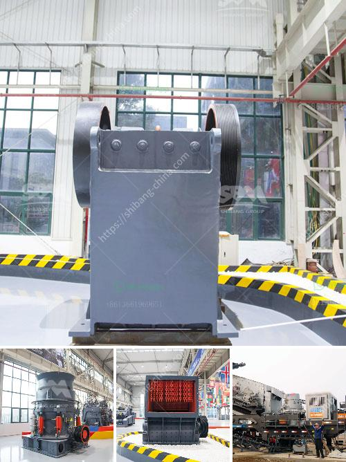

<h3>cone crusher south africa</h3>
The introduction of the cone crusher South Africa's term concept refers to the integrated design of the entire mine with the most important scientific and technological achievements in South Africa, which initiates the cone crusher on the market in South Africa.

The cone crusher term concept refers to the integration of the entire cone crusher South Africa, set both crushing and shaping functions, and optimizes the functions of each equipment strictly. Comparing with other traditional stone crushers, the cone crusher South Africa has higher productivity and convenient maintenance. All kinds of stones and rocks, such as pebbles, iron ore, limestone, granite, basalt, etc., are easily crushed by the cone crusher South Africa.

To meet the customers' demands, the cone crusher South Africa can effectively improve the crushing ratio. For example, when it is used for medium crushing, it can crush big stones and rocks to sma
<h3>Contact us</h3><ul><li><strong>Whatsapp:&nbsp;<a href="https://wa.me/8613661969651">+8613661969651</a></strong></li><li><a href="https://swt.shibang-china.com/?git&amp;zhl&amp;cone crusher south africa"><strong>Online Service(chat now)</strong></a></li></ul><h3>Related</h3><ul><li><a href='stone crusher specification.md'>stone crusher specification</a></li><li><a href='gypsum powder production line germany.md'>gypsum powder production line germany</a></li><li><a href='small ball mill suppliers in sri lanka.md'>small ball mill suppliers in sri lanka</a></li><li><a href='type of stone crushers.md'>type of stone crushers</a></li><li><a href='vertical mills retention time formula.md'>vertical mills retention time formula</a></li></ul>