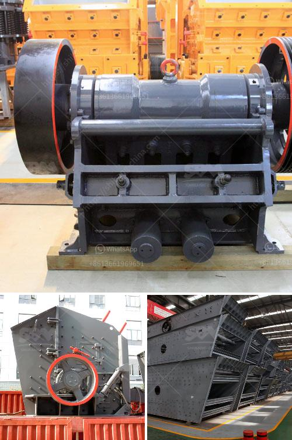

<h3>cone crusher uae dealer</h3>
Cone crushers play a key role in the aggregate and mining industries. They are used to crush and process hard materials, providing efficient and reliable operation. In the United Arab Emirates (UAE), the local dealer plays a crucial role in ensuring the availability of cone crushers and supporting customers' needs. This article explores the significance of cone crusher UAE dealers and highlights their key features and benefits.

Cone crushers are machines that perform crushing and processing functions by squeezing or compressing materials between a moving mantle and a stationary concave. They are designed to break down larger rocks, ores, and minerals into smaller, more manageable sizes. Cone crushers offer several advantages, including high productivity, excellent particle shape, low maintenance requirements, and a reduced chance of downtime.

For consumers and businesses in the UAE, having a reliable and well-established cone crusher dealer is crucial. A reputable dealer serves as a one-stop-shop for all cone crusher needs, offering a wide range of products, professional advice, and exceptional customer service. The dealer's expertise helps customers make informed decisions and select the most appropriate cone crusher for their specific requirements.

A cone crusher UAE dealer typically maintains a comprehensive inventory of cone crushers from various manufacturers. This ensures customers have access to a diverse range of options, including different sizes, capacities, and features. With a wide selection available, customers can find the perfect cone crusher to match their production requirements and budget.

A cone crusher UAE dealer employs highly skilled and extensively trained technicians who possess a thorough understanding of cone crusher technology. They are capable of providing professional guidance and technical support, including installation, training, maintenance, and troubleshooting. This expertise ensures that customers receive reliable and optimal performance from their cone crushers, minimizing any potential issues or delays.

The advantage of having a local cone crusher dealer is the accessibility to efficient customer support. Whether customers require spare parts, repairs, or regular maintenance, a UAE dealer can offer quick assistance. Dealers can also arrange on-site visits, ensuring minimal downtime and optimizing productivity.

Additionally, a reputable cone crusher dealer in the UAE offers superior after-sales service, reinforcing their commitment to customer satisfaction. Warranty coverage, extended service contracts, and support for scheduled maintenance are just a few examples of the comprehensive after-sales services provided by UAE dealers. These services provide peace of mind, knowing that any future requirements will be promptly addressed.

The cone crusher UAE dealer plays a significant role in facilitating cone crusher availability and delivering efficient solutions to the UAE's aggregate and mining industries. With their wide range of cone crusher options, technical expertise, prompt customer support, and comprehensive after-sales services, dealers ensure that customers can overcome challenges and maximize operational efficiency. Choosing a reliable UAE dealer is essential for businesses and individuals seeking to invest in cone crushers by ensuring a seamless purchasing experience and long-term satisfaction.
<h3>Contact us</h3><ul><li><strong>Whatsapp:&nbsp;<a href="https://wa.me/8613661969651">+8613661969651</a></strong></li><li><a href="https://swt.shibang-china.com/?git&amp;zhl&amp;cone crusher uae dealer"><strong>Online Service(chat now)</strong></a></li></ul><h3>Related</h3><ul><li><a href='metal crusher for rent.md'>metal crusher for rent</a></li><li><a href='stone crusher capsule.md'>stone crusher capsule</a></li><li><a href='cobble crusher supplier.md'>cobble crusher supplier</a></li><li><a href='ton per hour gold wash plants.md'>ton per hour gold wash plants</a></li><li><a href='agen jaw crusher kenya.md'>agen jaw crusher kenya</a></li></ul>