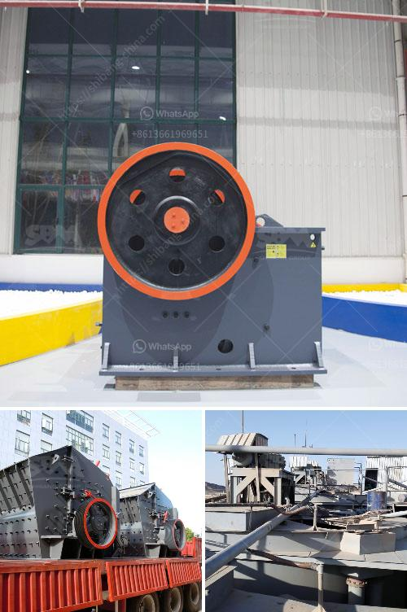

<h3>cone crusher zenith</h3>
A cone crusher is a powerful machine that is commonly used in the mining and construction industries to crush various materials, such as river rocks, granite, and limestone. With its robust design and high production capability, cone crushers are becoming increasingly popular for their ability to produce finely crushed materials. One such cone crusher that has been making waves in the industry is the Zenith cone crusher.

Zenith is a global manufacturer of cone crushers and has been working diligently to develop high-quality crushers that are efficient, productive, and reliable. The company has designed and developed several cone crusher models to suit a wide range of applications and customer requirements. One of the standout models in their product lineup is the Zenith cone crusher.

The Zenith cone crusher is known for its advanced features, such as a large crushing ratio, high productivity, low energy consumption, and uniform product granularity. It is extensively used in the mining and construction industries for crushing various types of ores and rocks of medium or above hardness.

One of the key features of the Zenith cone crusher is its hydraulic adjustment system, which allows the operator to easily adjust the crusher settings to achieve the desired product size. This feature eliminates the need for manual intervention, reducing downtime and improving overall operational efficiency. The hydraulic system also ensures a constant crushing force, resulting in improved product quality.

Another standout feature of the Zenith cone crusher is its intelligent control system. This system continuously monitors and adjusts the crusher's settings to optimize performance and prevent overloading. It also provides real-time data on operational parameters, such as crusher speed, oil temperature, and motor current, enabling operators to make informed decisions and ensure optimal crusher performance.

In terms of safety, the Zenith cone crusher is second to none. It is equipped with advanced safety features, such as a lock cylinder, hydraulic clearing chamber, and an anti-spin system. These features provide enhanced protection against potential hazards, such as tramp iron or other uncrushable materials, ensuring the crusher operates safely and reliably.

The Zenith cone crusher is also designed for easy maintenance. It is equipped with a user-friendly interface, allowing operators to access and control all the key functions of the crusher. The crusher's components are also easily accessible for inspection, maintenance, and replacement, further reducing downtime and increasing operational efficiency.

In conclusion, the Zenith cone crusher brings innovation and advanced technology to the crushing equipment industry. Its robust design, high productivity, and intelligent control system make it a preferred choice for mining and construction companies worldwide. With its ability to efficiently crush a variety of materials and its user-friendly features, the Zenith cone crusher is undoubtedly a game-changer in the crushing equipment market.
<h3>Contact us</h3><ul><li><strong>Whatsapp:&nbsp;<a href="https://wa.me/8613661969651">+8613661969651</a></strong></li><li><a href="https://swt.shibang-china.com/?git&amp;zhl&amp;cone crusher zenith"><strong>Online Service(chat now)</strong></a></li></ul><h3>Related</h3><ul><li><a href='screening coal crushing plant.md'>screening coal crushing plant</a></li><li><a href='iron ore washing plant.md'>iron ore washing plant</a></li><li><a href='roller conveyor belts.md'>roller conveyor belts</a></li><li><a href='manufacturer of coal processing equipment.md'>manufacturer of coal processing equipment</a></li><li><a href='cobalt ore mining processing plant.md'>cobalt ore mining processing plant</a></li></ul>