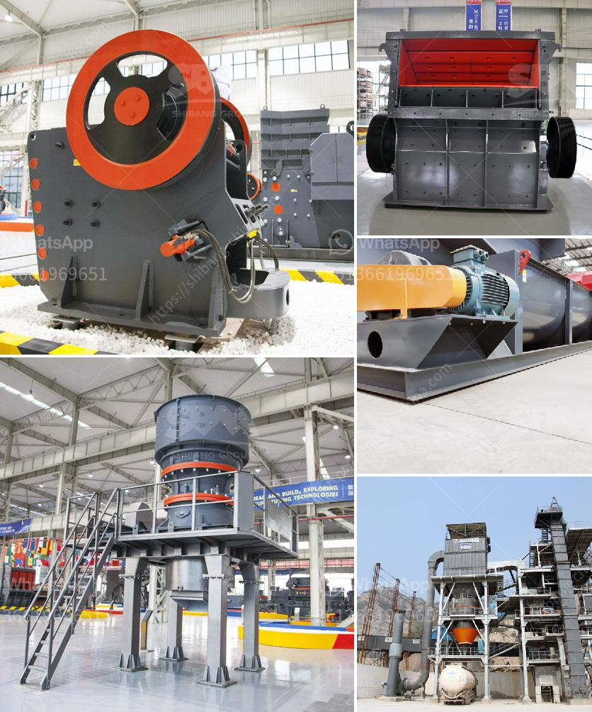

<h3>cone crushers to rent south africa</h3>
Are you in the process of searching for a cone crusher for your company here in South Africa? The demand for crushers is immense, and the cone crushers are specifically suitable for crushing hard and medium hard ore and rocks, such as iron ore, limestone, copper ore, quartz, granite, and sandstones.

The cone crusher is a versatile machine that can be used in all crushing stages and for any demanding conditions. Cone crushers are equipped with a hydraulic setting adjustment system that allows the adjustment of the crusher settings to match the material, feed size, and capacity requirements. This ensures optimal performance, seamless operation, and high productivity.

When it comes to renting a cone crusher for rock crushing applications, it can be challenging to find the optimal machine for your specific needs. Whether you are looking for ease-of-use, high flexibility, or maximum crushing efficiency, a cone crusher is often the most versatile choice. Here are some factors to consider when renting a cone crusher:

1. Size and Capacity: The size and capacity of the cone crusher determine the maximum size of the rocks that can be crushed and the production capacity of the machine. Ensure that the chosen cone crusher has the capacity to handle your material and production requirements.

2. Efficiency: Look for a cone crusher that is known for its efficient crushing capabilities. A cone crusher with high efficiency helps to increase crushing efficiency and reduce operational costs. Choose a machine that can handle the maximum feed size and still provide excellent particle shape and size reduction.

3. Maintenance and Service: Maintenance and service are essential aspects to consider when renting a cone crusher. Ensure that the rental company provides regular maintenance and service to keep the machine in optimal condition and minimize downtime. A well-maintained machine can significantly increase your productivity.

4. Portability and Mobility: If your crushing operation requires frequent relocation, consider renting a portable cone crusher. Portable cone crushers are equipped with wheels or tracks, allowing them to be easily transported from one site to another. This flexibility ensures that you can crush your material wherever it is needed, saving time and resources.

5. Safety Features: Safety is paramount in any operation, and renting a cone crusher with reliable safety features is critical. Look for a cone crusher that is equipped with advanced features like hydraulic tramp release system, overload protection, and automatic reset. These features protect the machine from potential damage caused by uncrushable materials or excessive overload.

In conclusion, renting a cone crusher from a reputable rental service provider is the best way to ensure that your business is fully equipped for all your crushing needs. With the latest technology and equipment, you can increase your productivity, reduce downtime, and generate more revenue. So, if you are in South Africa and searching for cone crushers to rent, look no further than Pilot Crushtec.
<h3>Contact us</h3><ul><li><strong>Whatsapp:&nbsp;<a href="https://wa.me/8613661969651">+8613661969651</a></strong></li><li><a href="https://swt.shibang-china.com/?git&amp;zhl&amp;cone crushers to rent south africa"><strong>Online Service(chat now)</strong></a></li></ul><h3>Related</h3><ul><li><a href='stone crushing plant business plan.md'>stone crushing plant business plan</a></li><li><a href='bazer stone crusher.md'>bazer stone crusher</a></li><li><a href='aggregate crusher plant price.md'>aggregate crusher plant price</a></li><li><a href='how to make clay from powder clay.md'>how to make clay from powder clay</a></li><li><a href='tracked mobile screening plant.md'>tracked mobile screening plant</a></li></ul>