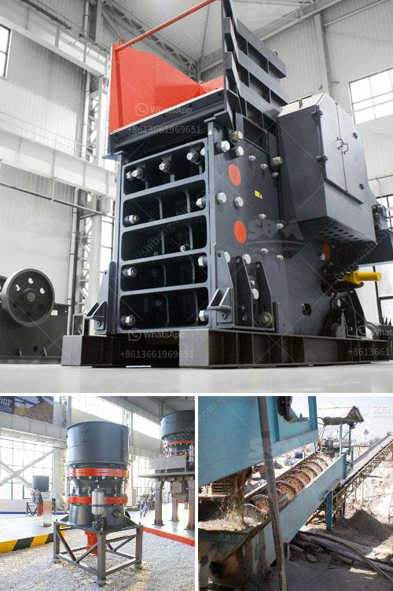

<h3>cone crushing plant elevation</h3>
When it comes to crushing and screening operations, the cone crushing plant plays a vital role in achieving the desired end product. This portable and highly efficient plant is designed to crush hard and abrasive materials such as granite, basalt, and river gravel. However, one essential aspect that is often overlooked during the planning and installation phase is the elevation of the cone crushing plant. This article aims to shed light on the significance of considering elevation in order to ensure optimal efficiency and productivity.

The elevation of the cone crushing plant refers to the height at which it is installed in relation to the feeding and output conveyor belts. This factor is crucial for several reasons. Firstly, the elevation determines the angle at which the material is fed into the crusher. The steeper the angle, the faster the material is fed, resulting in higher crushing and screening capacity. On the contrary, a shallow angle will reduce the plant's potential to process materials efficiently, leading to lower productivity and increased wear on the machine.

Secondly, elevation affects the flow of material from the cone crusher to the screening unit. A higher elevation allows for a better gravitational flow, ensuring that oversized rocks and debris are efficiently screened out, preventing any further damage to downstream equipment. Moreover, an optimal elevation allows for a smooth and continuous material flow, reducing the risk of blockages and unnecessary downtime.

Thirdly, elevation plays a significant role in the overall logistics of the cone crushing plant. A well-designed elevation plan takes into account the transportation and loading of the material into the feeding hopper. It ensures that trucks or loaders can easily access and deliver the materials, minimizing handling time and optimizing operational efficiency.

Furthermore, considering the elevation is vital for maintenance and servicing operations. Adequate space should be provided beneath the cone crusher and other components for personnel to access and perform routine inspections, lubrication, and repairs. A good elevation plan considers the safety and accessibility of maintenance personnel, reducing the risks of accidents and injuries.

In conclusion, cone crushing plant elevation is a critical factor that directly impacts the efficiency, productivity, and overall performance of the crushing and screening operations. A well-planned and properly executed elevation plan ensures the ideal angle for material feeding, facilitates a smooth flow of materials, and maximizes the plant's capacity to process hard and abrasive materials. It also enhances the safety and accessibility for maintenance and servicing. Therefore, it is of utmost importance to engage experienced engineers and professionals to design and install the cone crushing plant at the optimal elevation, guaranteeing smooth operations, extended equipment lifespan, and improved profitability for any crushing and screening project.
<h3>Contact us</h3><ul><li><strong>Whatsapp:&nbsp;<a href="https://wa.me/8613661969651">+8613661969651</a></strong></li><li><a href="https://swt.shibang-china.com/?git&amp;zhl&amp;cone crushing plant elevation"><strong>Online Service(chat now)</strong></a></li></ul><h3>Related</h3><ul><li><a href='cost of setting up a quarry crusher plant.md'>cost of setting up a quarry crusher plant</a></li><li><a href='price of quarry crusher machines.md'>price of quarry crusher machines</a></li><li><a href='cost for a metal crusher in kerala.md'>cost for a metal crusher in kerala</a></li><li><a href='kaolin crusher processing plant.md'>kaolin crusher processing plant</a></li><li><a href='grinding machine palletsgrinding machine palvisor.md'>grinding machine palletsgrinding machine palvisor</a></li></ul>