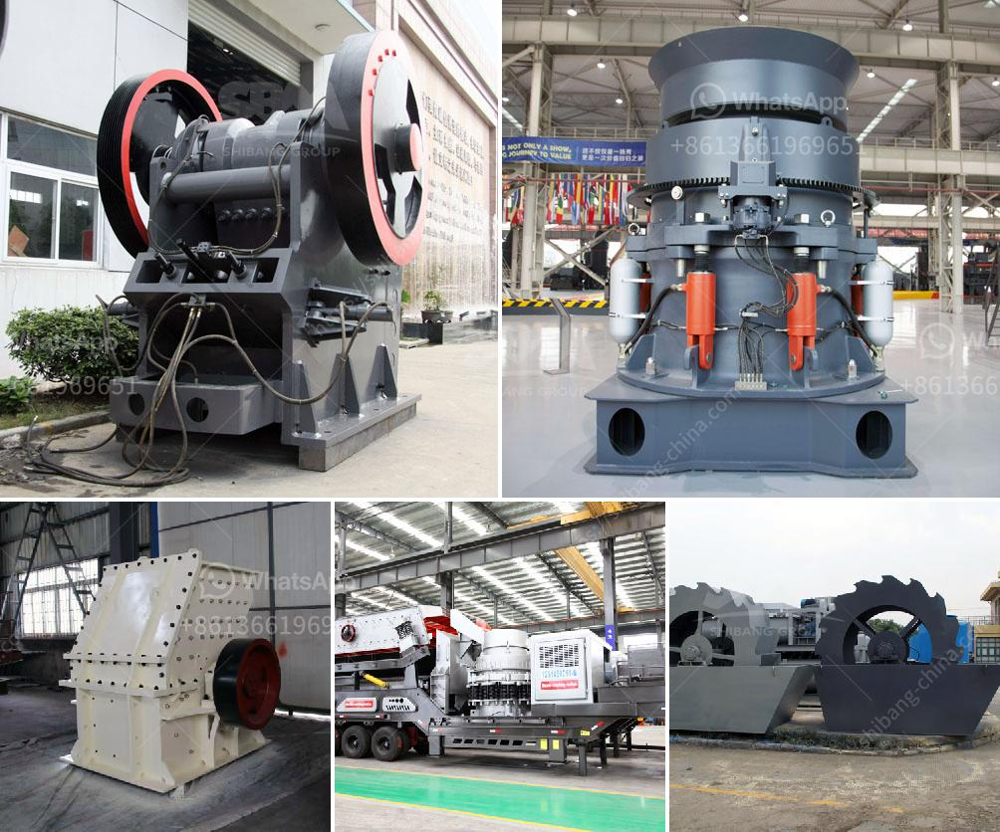

<h3>contact list of stone crusher companies in south africa</h3>
Stone crusher companies in South Africa are experiencing a significant increase in demand for their products as a result of the country’s expanding construction industry and road construction projects. Not only are these projects boosting the sales growth of stone crusher companies, but they are also accelerating the growth of various other industries including cement plants, coal mines, steel plants, and many more.

Due to such an increase in demand, the need for stone crushers has become crucial in South Africa. These machines are primarily used for reducing larger-sized stones into smaller ones, allowing their use in various construction applications such as a building material, road construction, and railway ballast.

For individuals or companies looking for reputable stone crusher suppliers in South Africa, you can rely on the following companies to assist you.

Pilot Crushtec is Southern Africa's leading supplier of quarrying and mining equipment and was founded in 1990. Since then, it has expanded its range of solutions to crushing, screening, and feeding equipment, as well as asphalt manufacturing and concrete batching plants.

Red Rhino Mini Crushers is a small-sized company that has been around since 2006. It has grown steadily and now has a diverse range of crushers from jaw, impact, and cone crushers to screeners and more. Red Rhino is committed to providing the highest quality machines available.

Metso Minerals is a global company that provides solutions for crushing, screening, and tailings management in the mining and construction industries. With over 100 years of experience, they have developed advanced technology to meet the ever-changing needs of their customers.

African Mining and Crushing SA (Pty) Ltd is one of South Africa’s largest mining and crushing contractors. They provide crushing and screening services for mining companies, civil engineering projects, and various other industries. Their extensive fleet of crushing equipment makes them a reliable partner.

Seneca Crushing & Screening (Pty) Ltd is a South African company that specializes in mobile crushing and screening services. They provide a wide range of services including bulk earthworks, demolitions, and open cast mining.

These are just a few examples of stone crusher companies in South Africa. These companies can offer a range of solutions and products depending on your needs, from mobile crushing equipment to fixed crushers. If you are interested in exploring the South African stone crusher market, contact these companies for more information and assistance.
<h3>Contact us</h3><ul><li><strong>Whatsapp:&nbsp;<a href="https://wa.me/8613661969651">+8613661969651</a></strong></li><li><a href="https://swt.shibang-china.com/?git&amp;zhl&amp;contact list of stone crusher companies in south africa"><strong>Online Service(chat now)</strong></a></li></ul><h3>Related</h3><ul><li><a href='crushing machine manufacturers china.md'>crushing machine manufacturers china</a></li><li><a href='rock crushers tonne per hour.md'>rock crushers tonne per hour</a></li><li><a href='latest three roll mills.md'>latest three roll mills</a></li><li><a href='price of stone crusher size.md'>price of stone crusher size</a></li><li><a href='lm series vertical mill.md'>lm series vertical mill</a></li></ul>