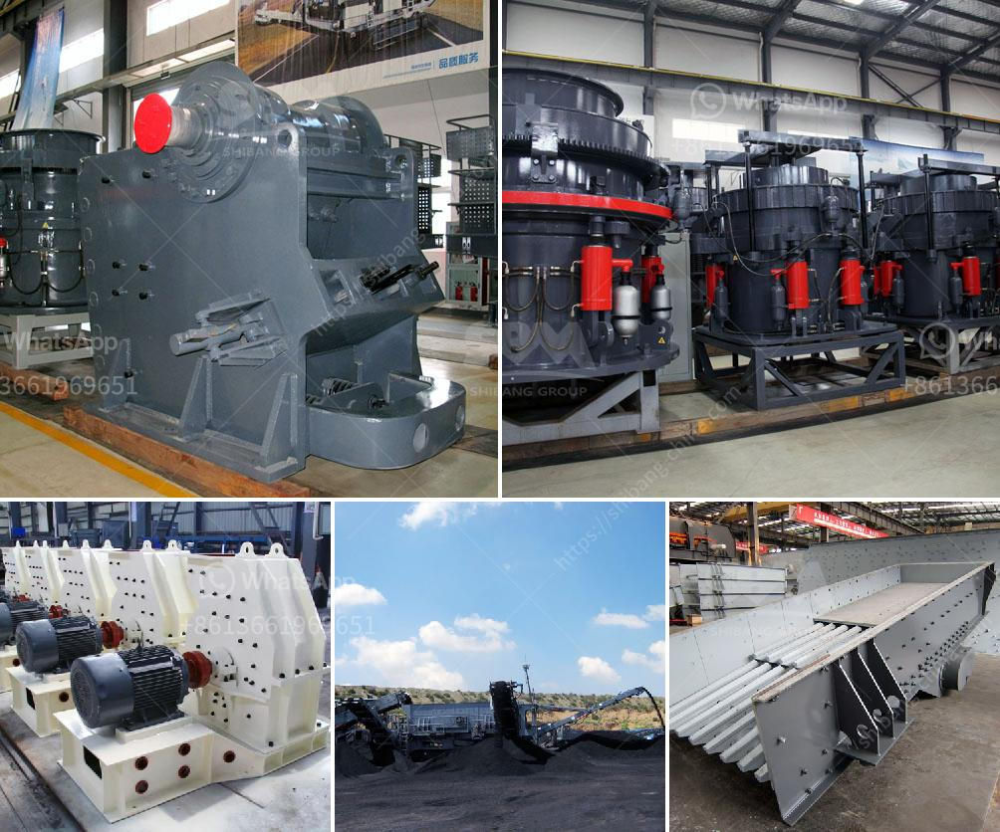

<h3>contribution of quarrying in nigeria economy</h3>
The quarrying industry in Nigeria is one of the vibrant sectors of the country’s economy. This sector has contributed immensely to the nation’s economic growth and development over the years. Quarrying also known as process of extracting minerals and other geological materials from the earth’s surface has been a significant part of the Nigerian economy for decades.

Firstly, quarrying has helped to provide employment opportunities for many Nigerians. With a high unemployment rate in the country, the quarrying industry has offered job opportunities to both skilled and unskilled individuals. It has created a source of income for many families, alleviating poverty and reducing the burden on the government in terms of social welfare and unemployment benefits.

Secondly, quarrying contributes to the Gross Domestic Product (GDP) of the country. The extraction of minerals and other materials from quarries is a profitable venture and important for economic growth. The revenue generated from quarrying contributes to the overall GDP of Nigeria, making it a significant contributor to the country’s economy.

Thirdly, quarrying supports other industries in the country. Many industries rely on the raw materials extracted from quarries for their production processes. For example, the construction industry depends on quarrying for the supply of sand, gravel, and crushed stones, which are essential for infrastructure development. The mining industry also relies on quarrying for the extraction of minerals and ores used in the production of various goods.

Furthermore, quarrying fosters local and foreign investments in Nigeria. Due to the abundant mineral resources in the country, both local and international investors are attracted to invest in the quarrying industry. This investment contributes to the growth of the economy through job creation, technology transfer, and revenue generation.

In conclusion, quarrying has played a crucial role in the Nigerian economy. It has provided employment opportunities, contributed to the GDP, supported other industries, and attracted investments. The quarrying sector should be adequately regulated to ensure sustainable practices that will safeguard the environment while maximizing the economic benefits to the nation.
<h3>Contact us</h3><ul><li><strong>Whatsapp:&nbsp;<a href="https://wa.me/8613661969651">+8613661969651</a></strong></li><li><a href="https://swt.shibang-china.com/?git&amp;zhl&amp;contribution of quarrying in nigeria economy"><strong>Online Service(chat now)</strong></a></li></ul><h3>Related</h3><ul><li><a href='manufacturing process of bentonite powder.md'>manufacturing process of bentonite powder</a></li><li><a href='mining processing machine prices.md'>mining processing machine prices</a></li><li><a href='manganese ore concentrate south africa.md'>manganese ore concentrate south africa</a></li><li><a href='cobalt ore mining processing plant.md'>cobalt ore mining processing plant</a></li><li><a href='quartz crusher plant cost.md'>quartz crusher plant cost</a></li></ul>