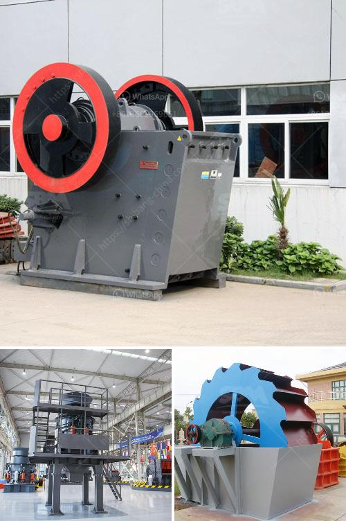

<h3>conveyor belt suppliers in lusaka</h3>
In the bustling city of Lusaka, the capital of Zambia, numerous industries rely on the efficient transportation of goods and materials. Whether it is in mining, manufacturing, agriculture, or logistics, having a reliable conveyor belt system is crucial for ensuring smooth operations. Fortunately, Lusaka is home to several reputable conveyor belt suppliers that offer a wide range of solutions tailored to meet the unique needs of various industries.

One such supplier is XYZ Conveyor Belts Ltd, a renowned company that has been serving the Lusaka market for over two decades. With a strong commitment to quality and customer satisfaction, XYZ Conveyor Belts Ltd provides a comprehensive portfolio of conveyor belt solutions suitable for both heavy-duty and light-duty applications. From rubber belts for mining and quarrying to PVC and nylon belts for food processing and packaging, they offer a wide variety of options to cater to different industries' specific requirements.

Another leading supplier in Lusaka is ABC Conveyor Systems Ltd, focusing primarily on industrial conveyor belts. They pride themselves on delivering high-quality products that enhance operational efficiency while ensuring employee safety. ABC Conveyor Systems Ltd offers an extensive range of conveyor belts, including modular belts, steel belts, and timing belts, suitable for industries such as automotive, agriculture, and general manufacturing.

Additionally, many conveyor belt suppliers in Lusaka also provide value-added services such as belt installation, maintenance, and repairs. This ensures that businesses can rely on their chosen supplier not only for the initial purchase but also for ongoing support and optimization of their conveyor systems.

When selecting a conveyor belt supplier in Lusaka, industry players need to consider several factors. Reliability, product quality, and customer service are paramount to ensure smooth operations and minimize downtime. It's essential to choose suppliers with a proven track record, positive customer reviews, and a wide range of belt options to match specific application requirements.

In conclusion, the presence of reputable conveyor belt suppliers in Lusaka is critical for industries relying on efficient material handling. These suppliers offer a wide range of conveyor belt solutions, tailored to meet the unique needs of various industries, and provide value-added services such as installation, maintenance, and repairs. By choosing a reliable supplier, businesses in Lusaka can enhance their operational efficiency and ensure the smooth and safe transportation of goods and materials.
<h3>Contact us</h3><ul><li><strong>Whatsapp:&nbsp;<a href="https://wa.me/8613661969651">+8613661969651</a></strong></li><li><a href="https://swt.shibang-china.com/?git&amp;zhl&amp;conveyor belt suppliers in lusaka"><strong>Online Service(chat now)</strong></a></li></ul><h3>Related</h3><ul><li><a href='impact crusher suppliers italy.md'>impact crusher suppliers italy</a></li><li><a href='how to start a rock quarry business.md'>how to start a rock quarry business</a></li><li><a href='cost of silica sand mine equipment.md'>cost of silica sand mine equipment</a></li><li><a href='concrete crusher price philippines.md'>concrete crusher price philippines</a></li><li><a href='canyon hammer mills.md'>canyon hammer mills</a></li></ul>