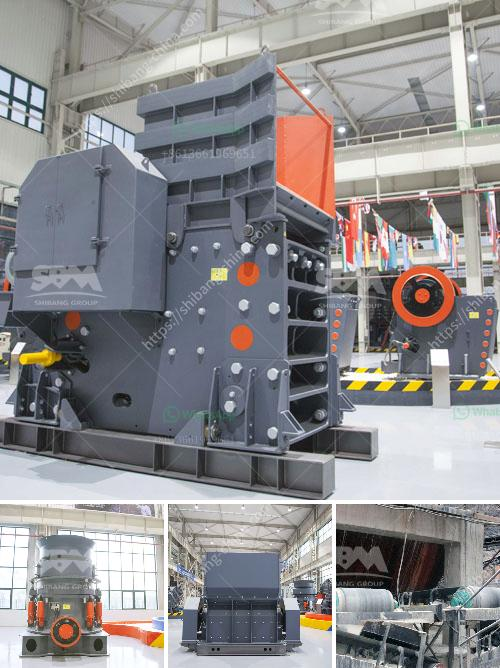

<h3>conveyor belts for dies</h3>
In the fast-paced world of textile production, the need for efficient and reliable systems is paramount. One such system that has revolutionized the textile industry is the conveyor belts for dyes. With their ability to streamline and automate the dyeing process, these belts have become an indispensable tool for textile manufacturers across the globe.

Traditionally, dyeing fabrics involved manual labor and a significant amount of time. Workers would have to individually immerse each fabric or garment into large vats filled with dye, which posed several challenges. In addition to the labor-intensive nature of the process, achieving consistent and uniform dye distribution was a constant struggle. Moreover, there was a risk of human error, leading to potential product defects.

Conveyor belts specifically designed for dyeing have completely transformed this process. These belts efficiently transport the fabric or garments through a series of dyeing stations, where the dye is applied in a controlled and uniform manner. By eliminating the need for manual labor, they not only save time but also reduce the risk of errors.

The key advantage of conveyor belts for dyes lies in their ability to ensure consistent dye distribution. Through innovative design and engineering, these belts ensure that the fabric or garments come into complete contact with the dye, resulting in even and vibrant coloration. This consistency significantly enhances the quality of the final product, giving textile manufacturers a competitive edge in the market.

Furthermore, conveyor belts enable higher production volumes. With their automated and continuous operation, they can process a larger quantity of fabric or garments in a given timeframe. This increase in productivity boosts efficiency and ultimately leads to cost savings for manufacturers. The ability to handle a high volume of items also makes conveyor belts ideal for large-scale textile production facilities.

In conclusion, conveyor belts designed for dyeing processes offer numerous advantages for the textile industry. From enhancing efficiency and productivity to ensuring consistent dye distribution, these belts have become an integral part of modern textile manufacturing. With the continuous advancements in technology and design, conveyor belts for dyes will undoubtedly continue to play a vital role in shaping the future of the textile industry.
<h3>Contact us</h3><ul><li><strong>Whatsapp:&nbsp;<a href="https://wa.me/8613661969651">+8613661969651</a></strong></li><li><a href="https://swt.shibang-china.com/?git&amp;zhl&amp;conveyor belts for dies"><strong>Online Service(chat now)</strong></a></li></ul><h3>Related</h3><ul><li><a href='hammer crusher price one ton per hour.md'>hammer crusher price one ton per hour</a></li><li><a href='portable gold mining plant pdf.md'>portable gold mining plant pdf</a></li><li><a href='gold stone crusher images.md'>gold stone crusher images</a></li><li><a href='calculation of production mobile crushers.md'>calculation of production mobile crushers</a></li><li><a href='portable conveyor belts for sale.md'>portable conveyor belts for sale</a></li></ul>