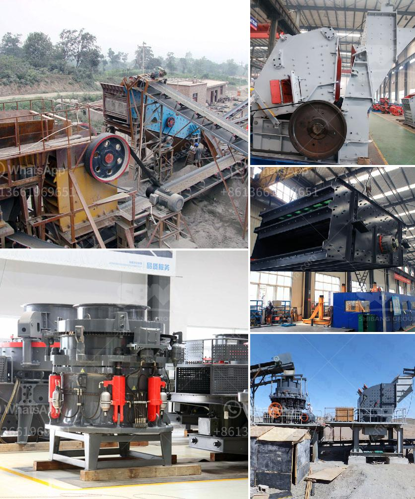

<h3>conveyor belts for sand for sale</h3>
Conveyor belts have revolutionized various industries by providing a cost-effective and efficient way to transport materials from one place to another. When it comes to handling bulk quantities of sand or any granular material, conveyor belts play a vital role in improving productivity and streamlining operations.

Sand is a commonly used material in construction, landscaping, and manufacturing industries. Its transportation can be a challenging task due to its bulky and heavy nature. However, with the help of conveyor belts, this process becomes seamless and hassle-free.

Conveyor belts for sand are designed specifically to handle abrasive and fine-grained materials efficiently. They are built with durable materials to withstand harsh working conditions and heavy loads. These belts are equipped with various features such as cleats, sidewalls, and tracking systems, which ensure that the sand remains stable and secure during the transportation process.

One of the significant advantages of using conveyor belts for sand is the ability to move large volumes of material quickly. These belts can be customized in terms of width, length, and speed, allowing for the efficient and continuous flow of sand. Additionally, conveyor belts can be easily integrated into existing production lines, further improving workflow and reducing labor costs.

Another noteworthy advantage of investing in conveyor belts for sand is the significant reduction in manual labor. Traditionally, transporting sand manually involves a considerable workforce and the use of heavy machinery like loaders or dump trucks. However, with conveyor belts, operators can automate the material handling process, minimizing the need for manual labor and increasing overall productivity.

Furthermore, conveyor belts for sand are designed to reduce spills and material wastage. The belts are engineered to prevent clogging or choking, ensuring that the sand flows smoothly without interruptions. With high-quality belts, businesses can minimize product loss and maintain a clean working environment.

In conclusion, conveyor belts for sand for sale provide an ideal solution for industries dealing with bulk material handling. These belts enhance efficiency, productivity, and cost-effectiveness by enabling the continuous and automated transportation of sand. By investing in conveyor belts, companies can streamline their operations, improve workflow, and achieve higher profitability.
<h3>Contact us</h3><ul><li><strong>Whatsapp:&nbsp;<a href="https://wa.me/8613661969651">+8613661969651</a></strong></li><li><a href="https://swt.shibang-china.com/?git&amp;zhl&amp;conveyor belts for sand for sale"><strong>Online Service(chat now)</strong></a></li></ul><h3>Related</h3><ul><li><a href='price of stone crushing machine in nigeria.md'>price of stone crushing machine in nigeria</a></li><li><a href='mobile crusher line.md'>mobile crusher line</a></li><li><a href='cone crusher device.md'>cone crusher device</a></li><li><a href='how to calculate crushing plant efficency.md'>how to calculate crushing plant efficency</a></li><li><a href='factory price tile adhesive manufacturing plant.md'>factory price tile adhesive manufacturing plant</a></li></ul>