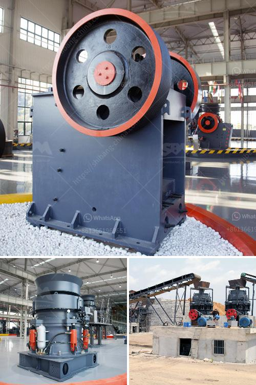

<h3>conveyor chain suppliers south africa</h3>
Conveyor chains are essential components in various industries, ensuring the smooth flow of products and materials during production processes. In South Africa, there is a growing demand for high-quality conveyor chains to support diverse sectors such as mining, agriculture, manufacturing, and logistics. To meet this demand, several conveyor chain suppliers have emerged, offering a wide range of products and services.

One of the leading conveyor chain suppliers in South Africa is Conveyor Chain Manufacturers, based in Johannesburg. With more than 40 years of experience, they specialize in the design, manufacturing, and installation of conveyor chains for various applications. Their product range includes standard chains, as well as custom-engineered chains, designed to meet the specific requirements of individual industries.

Another reputable supplier is Chainmeister, located in Cape Town. They provide a comprehensive selection of conveyor chains, from simple roller chains to complex specialty chains. With a strong focus on quality, Chainmeister collaborates with global manufacturers to offer top-notch products that ensure optimal performance and durability in any demanding environment.

Conveyor Technologies, based in Durban, is also a prominent supplier in South Africa. They offer an extensive range of conveyor chains, designed to handle heavy loads and withstand harsh working conditions. Their product portfolio includes plastic, stainless steel, and carbon steel chains, catering to a wide range of industries.

These are just a few examples of conveyor chain suppliers in South Africa, but the market is bustling with many more players. When selecting a supplier, it is crucial to consider their expertise, product quality, reliability, and customer service. In addition, it is advisable to choose a supplier that offers maintenance and after-sales support to ensure the longevity and smooth operation of your conveyor chains.

In conclusion, the conveyor chain suppliers in South Africa play a vital role in supporting various industries and facilitating efficient production processes. With their diverse product offerings and commitment to quality, these suppliers contribute significantly to the development and growth of the country's economy.
<h3>Contact us</h3><ul><li><strong>Whatsapp:&nbsp;<a href="https://wa.me/8613661969651">+8613661969651</a></strong></li><li><a href="https://swt.shibang-china.com/?git&amp;zhl&amp;conveyor chain suppliers south africa"><strong>Online Service(chat now)</strong></a></li></ul><h3>Related</h3><ul><li><a href='i want to buy a quarry machine nigeria.md'>i want to buy a quarry machine nigeria</a></li><li><a href='mobile crushers concrete aggregate.md'>mobile crushers concrete aggregate</a></li><li><a href='how to set up a granite quarry.md'>how to set up a granite quarry</a></li><li><a href='ball mill balls suppliers.md'>ball mill balls suppliers</a></li><li><a href='vertical roller mill for cement.md'>vertical roller mill for cement</a></li></ul>