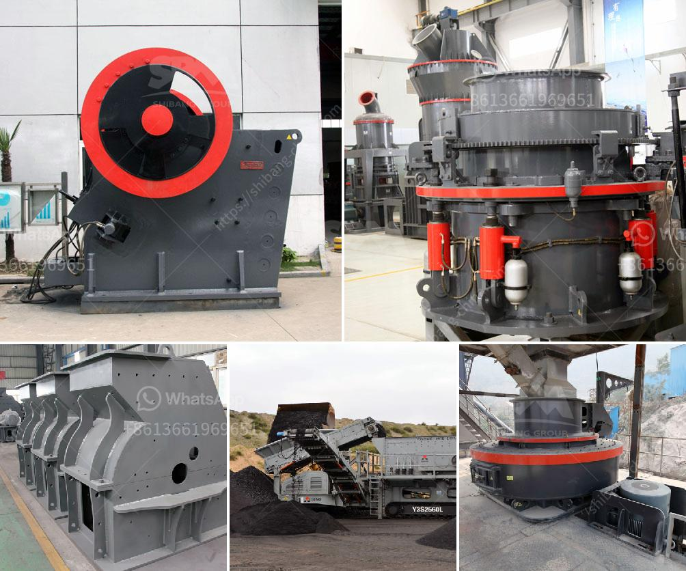

<h3>copper mining in zambia</h3>
Copper mining has been a significant economic activity in Zambia for many decades. The country is one of the largest producers of copper in Africa, ranking eighth globally in terms of production. Located in the central part of Southern Africa, Zambia has abundant mineral resources, with copper being its primary export commodity.

The history of copper mining in Zambia can be traced back to the 1920s, when large-scale mining commenced. Since then, there has been continuous development and expansion of the mining industry, with multiple mines operating across the country. The Copperbelt region, located in the northwestern part of Zambia, is the heart of the country's copper mining industry. It is home to several world-class copper mines and processing plants.

Copper mining plays a crucial role in Zambia's economic growth and development. The sector contributes significantly to the country's GDP and accounts for a substantial portion of its foreign exchange earnings. The revenue generated from copper exports helps finance various government projects, including infrastructure development, healthcare, and education.

Furthermore, the mining sector creates employment opportunities for thousands of Zambians. People from different parts of the country flock to mining towns in search of employment. The industry provides direct and indirect employment, such as mining operations, support services, and businesses catering to the needs of mining communities. Employment in the mining sector has a cascading effect on other sectors, stimulating economic growth and reducing poverty.

However, copper mining also poses challenges for Zambia. Environmental degradation, such as water pollution and deforestation, is a major concern. The extraction and processing of copper ore require significant energy and water, potentially leading to ecological problems if not managed properly. Sustainable mining practices, adherence to environmental regulations, and responsible waste management are essential to minimize the impact on the environment.

In conclusion, copper mining is a vital industry in Zambia, contributing to the country's economic development. However, it is crucial to strike a balance between economic prosperity and environmental sustainability. With proper management and adherence to responsible mining practices, Zambia can harness the potential of its copper resources while protecting its natural environment for future generations.
<h3>Contact us</h3><ul><li><strong>Whatsapp:&nbsp;<a href="https://wa.me/8613661969651">+8613661969651</a></strong></li><li><a href="https://swt.shibang-china.com/?git&amp;zhl&amp;copper mining in zambia"><strong>Online Service(chat now)</strong></a></li></ul><h3>Related</h3><ul><li><a href='basalt processing plant.md'>basalt processing plant</a></li><li><a href='distributor stone crusher di indonesia.md'>distributor stone crusher di indonesia</a></li><li><a href='linear vibrating screen specifications.md'>linear vibrating screen specifications</a></li><li><a href='rock crusher supplier.md'>rock crusher supplier</a></li><li><a href='features a hammer mill.md'>features a hammer mill</a></li></ul>