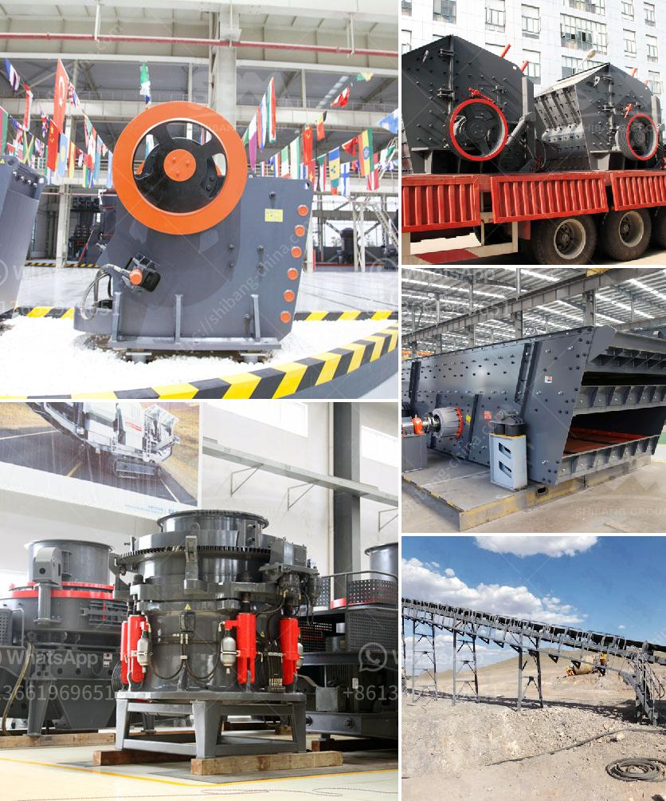

<h3>copper processing machine</h3>
Copper is a vital metal used in multiple industries, including construction, electrical appliances, and telecommunications. Its high electrical conductivity and durability make it an essential component in our daily lives. However, the process of extracting copper from its ore sources is an intricate and resource-intensive one. This is where copper processing machines come into play, revolutionizing the mining industry and ensuring a more efficient and sustainable copper production.

Copper processing machines are advanced equipment that are used to extract copper from its ore sources. These machines play a crucial role in enhancing the overall efficiency and productivity in copper mining operations. By automating various processes, copper processing machines not only reduce the labor requirements but also minimize the risk of human error and ensure a safer working environment.

One of the most commonly used copper processing machines is the flotation machine. This machine utilizes the hydrophobicity of copper-containing minerals, allowing them to adhere to air bubbles and float to the surface. This process separates the copper minerals from the surrounding gangue, enabling the production of concentrated copper ore. Flotation machines have evolved over the years, becoming more energy-efficient and requiring less maintenance, further improving their effectiveness in copper processing.

Another essential copper processing machine is the smelter. Smelting refers to the process of melting copper concentrate to remove impurities and obtain a pure copper product. Smelters are equipped with advanced technologies that ensure accurate temperature control and minimize environmental impacts, such as sulfur dioxide emissions. Improved smelting techniques have significantly reduced energy consumption while maximizing the yield of high-quality copper.

Additionally, advanced copper processing machines include crushers, mills, and magnetic separators. Crushers break down larger rocks into smaller, manageable pieces, making it easier to transport and process the copper ore. Mills further grind the ore to fine particles, enhancing the separation process. Magnetic separators are used to separate magnetic minerals from non-magnetic ones, effectively eliminating impurities in the final copper concentrate.

Furthermore, technological advancements have facilitated the development of automated copper processing machines. These machines integrate artificial intelligence and machine learning algorithms to optimize the entire copper processing workflow. They can monitor various parameters, adjust settings in real-time, and predict potential equipment failures, minimizing downtime and optimizing production output.

The adoption of copper processing machines has several benefits for the mining industry. Firstly, these machines optimize the extraction process, increasing the overall copper yield while minimizing the amount of waste generated. This not only reduces the environmental footprint but also maximizes the economic value obtained from copper mining operations.

Secondly, by automating various tasks, copper processing machines enhance worker safety. Manual handling of heavy machinery and exposure to hazardous substances poses numerous risks to workers. With the implementation of automated machines, the human interaction with these dangerous processes is minimized, reducing the potential for accidents and health hazards.

Finally, copper processing machines improve the sustainability of copper mining operations. By reducing energy consumption, water usage, and waste generation, the industry becomes more environmentally friendly. The efficient use of resources also contributes to cost savings and ultimately benefits the bottom line of mining companies.

In conclusion, copper processing machines have revolutionized the mining industry by improving efficiency, increasing productivity, and enhancing sustainability. The incorporation of cutting-edge technologies has led to significant advancements in copper extraction, benefiting both the industry and the environment. As the demand for copper continues to grow, the continuous development of high-performance copper processing machines will play a vital role in ensuring a sustainable supply of this essential metal.
<h3>Contact us</h3><ul><li><strong>Whatsapp:&nbsp;<a href="https://wa.me/8613661969651">+8613661969651</a></strong></li><li><a href="https://swt.shibang-china.com/?git&amp;zhl&amp;copper processing machine"><strong>Online Service(chat now)</strong></a></li></ul><h3>Related</h3><ul><li><a href='cone crusher device.md'>cone crusher device</a></li><li><a href='how to calculate the operating cost of a stone crusher.md'>how to calculate the operating cost of a stone crusher</a></li><li><a href='iron crushing plant in mexico.md'>iron crushing plant in mexico</a></li><li><a href='grinding machine palletsgrinding machine palvisor.md'>grinding machine palletsgrinding machine palvisor</a></li><li><a href='vibrating screen size 1mm.md'>vibrating screen size 1mm</a></li></ul>