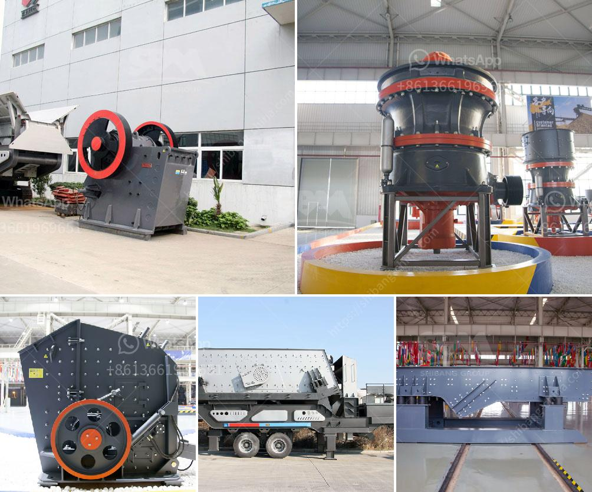

<h3>cost for a metal crusher in kerala</h3>
A metal crusher is an essential piece of machinery for any scrap metal recycling operation in Kerala. It is used to crush and shred metal scraps into smaller pieces, making it easier to transport and recycle. The cost of a metal crusher can vary depending on the capacity and technical specifications. This article will provide an overview of the cost for a metal crusher in Kerala.

One of the main factors influencing the cost of a metal crusher is its capacity. The capacity refers to the maximum amount of metal scraps that the crusher can process per hour. Higher capacity crushers are generally more expensive compared to lower capacity ones. The cost for a metal crusher with a capacity of 1-2 tons per hour can range from Rs. 70,000 to Rs. 3.5 lakh.

Another important factor is the power source for the crusher. Metal crushers can be powered by electricity or diesel engines. Electric-powered crushers are more common in urban areas where there is easy access to electricity. The cost for an electric-powered metal crusher can range from Rs. 70,000 to Rs. 1.5 lakh. On the other hand, diesel-powered crushers are more suitable for remote areas where electricity is not readily available. The cost for a diesel-powered metal crusher can range from Rs. 1.2 lakh to Rs. 3.5 lakh.

The size and weight of the metal crusher also influence its cost. Larger and heavier crushers require more materials and labor during the manufacturing process, which can increase the overall cost. The cost for a small-sized metal crusher weighing around 2 tons can range from Rs. 1.2 lakh to Rs. 2 lakh. On the other hand, the cost for a large-sized crusher weighing around 5-6 tons can range from Rs. 3 lakh to Rs. 4.5 lakh.

In addition to the initial cost of the metal crusher, there are other expenses to consider. For instance, there is the cost of transportation and assembly. The transportation cost can vary depending on the distance between the manufacturer and the buyer's location. Similarly, the assembly cost includes the charges for installation and commissioning of the crusher.

Apart from the cost of the metal crusher, it is essential to consider the operational and maintenance costs. Regular maintenance is crucial for ensuring the smooth operation and longevity of the machine. This includes lubrication, replacement of worn-out parts, and general repairs. The cost for maintenance and spare parts can range from Rs. 10,000 to Rs. 50,000 per year, depending on the usage and wear and tear.

In conclusion, the cost for a metal crusher in Kerala can vary based on the capacity, power source, size, and weight of the machine. It is advisable to compare prices from different manufacturers and consider the operational and maintenance costs before making a final decision. Additionally, while cost is an important factor, it is equally important to choose a reliable and efficient metal crusher that meets the specific requirements of your scrap metal recycling operation.
<h3>Contact us</h3><ul><li><strong>Whatsapp:&nbsp;<a href="https://wa.me/8613661969651">+8613661969651</a></strong></li><li><a href="https://swt.shibang-china.com/?git&amp;zhl&amp;cost for a metal crusher in kerala"><strong>Online Service(chat now)</strong></a></li></ul><h3>Related</h3><ul><li><a href='grinding ball mill price.md'>grinding ball mill price</a></li><li><a href='rencana anggaran biaya stone crusher.md'>rencana anggaran biaya stone crusher</a></li><li><a href='mtm raymond mill.md'>mtm raymond mill</a></li><li><a href='gypsum plant unit and utilities.md'>gypsum plant unit and utilities</a></li><li><a href='quartz powder making machine in andhra pradesh.md'>quartz powder making machine in andhra pradesh</a></li></ul>