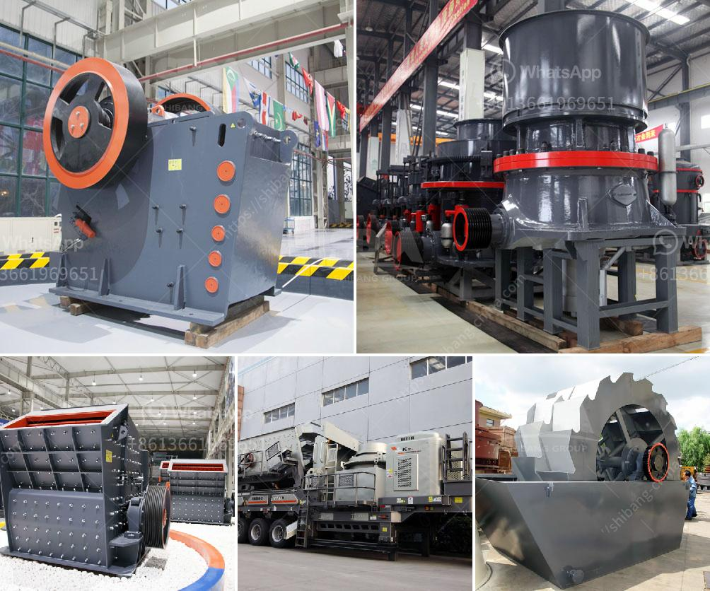

<h3>cost for small cement plant setup</h3>
Setting up a small cement plant for the first time can be daunting, especially in terms of cost. With careful planning and thorough research, however, it’s possible to establish a successful and profitable small cement plant. 

The cost of setting up a small cement plant varies depending on several factors. These factors include the location of the plant, the availability of raw materials, labor costs, and market demand. Generally, the cost of setting up a small cement plant ranges from $100,000 to $1 million.

Location is a crucial factor in determining the cost of setting up a cement plant. It is essential to select a location close to raw material sources, such as limestone quarries and shale deposits. This helps in minimizing transportation costs for raw materials and ensures a steady supply of essential resources.

Raw materials, including limestone, shale, and gypsum, are necessary for the production of cement. The proximity and availability of these resources impact the cost of setting up the plant.

Labor costs also play a significant role in determining the overall cost. This includes wages for skilled and unskilled workers required for operating machinery, managing operations, and other administrative tasks. Labor costs may vary based on the location of the plant and prevailing labor rates.

Market demand and competition are crucial factors that need consideration. Conducting a thorough market analysis helps in understanding the potential demand for cement in the region. This analysis provides valuable insights for market positioning and determining initial production capacity.

Other costs, including licensing, permits, land purchase or lease, machinery, and equipment, should also be considered. Electricity and water supply expenses, as well as maintenance and repair costs, are additional aspects to be factored in.

While setting up a small cement plant is an investment of time and capital, it can lead to long-term profitability. Proper planning, market research, and cost estimation are necessary for a smooth and successful venture.
<h3>Contact us</h3><ul><li><strong>Whatsapp:&nbsp;<a href="https://wa.me/8613661969651">+8613661969651</a></strong></li><li><a href="https://swt.shibang-china.com/?git&amp;zhl&amp;cost for small cement plant setup"><strong>Online Service(chat now)</strong></a></li></ul><h3>Related</h3><ul><li><a href='hammer crusher price one ton per hour.md'>hammer crusher price one ton per hour</a></li><li><a href='distributor stone crusher di indonesia.md'>distributor stone crusher di indonesia</a></li><li><a href='manufacturing process of bentonite powder.md'>manufacturing process of bentonite powder</a></li><li><a href='manufacturer of crushing equipment philippines.md'>manufacturer of crushing equipment philippines</a></li><li><a href='features a hammer mill.md'>features a hammer mill</a></li></ul>