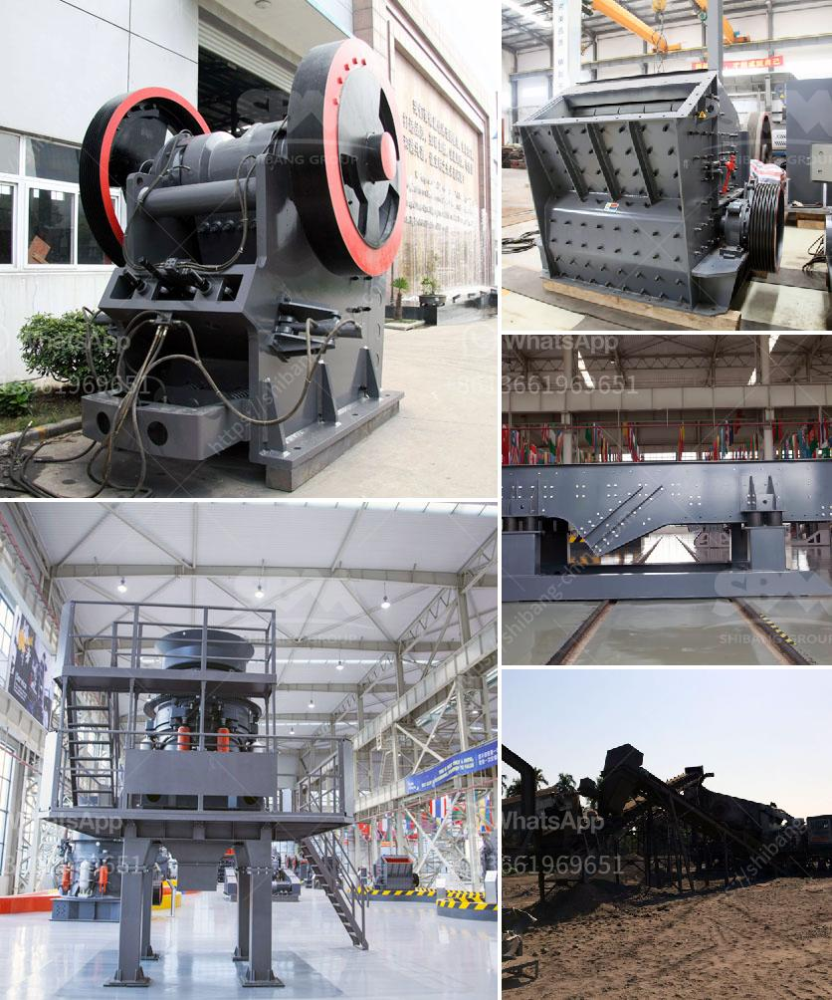

<h3>cost for starting a granite manufacturing</h3>
If you have a passion for construction materials and want to venture into the world of entrepreneurship, starting a granite manufacturing business could be a lucrative opportunity. Granite, with its durability, elegance, and timeless beauty, has become one of the most popular choices for countertops, flooring, and other architectural applications. While the idea of starting a granite manufacturing business may seem daunting, a cost analysis can help you understand the financial aspects involved.

The primary factor influencing the cost for starting a granite manufacturing business is the scale of your operation. For a small-scale manufacturing unit, an initial investment of around $100,000 to $300,000 is typically required. This includes the costs of procuring machinery, raw materials, and other essential supplies. However, this estimate can vary depending on your location, the availability of granite in your area, and the scope of your business.

Machinery is an important component of a granite manufacturing business. The most common machines required include stone cutting and polishing machines, bridge saws, CNC machines, and edge profilers. These machines can range in price from a few thousand dollars to several hundred thousand dollars, depending on their capacity, features, and brand. Expert advice from industry professionals can help you make informed decisions while investing in machinery.

In addition to machinery, you will need to factor in other costs such as renting or buying a suitable workspace, utilities, labor wages, marketing expenses, and insurance. These expenses will depend on the size and location of your business and the number of employees you plan to hire.

Lastly, it is essential to consider the ongoing operational costs for your granite manufacturing business. This includes the cost of raw materials such as granite slabs, chemicals, and maintenance supplies, as well as regular machine maintenance and repairs.

Starting a granite manufacturing business requires careful planning and financial analysis. It is crucial to conduct thorough market research, assess the demand for granite in your target market, and develop a comprehensive business plan. Seeking guidance from industry professionals or experts in the field can provide invaluable insights and help make your venture a success.

In conclusion, starting a granite manufacturing business can be a profitable venture, but it comes with its fair share of costs. By conducting a thorough cost analysis and planning adequately, you can ensure the financial viability of your business. With determination, hard work, and smart decision-making, your granite manufacturing business can flourish in the construction industry.
<h3>Contact us</h3><ul><li><strong>Whatsapp:&nbsp;<a href="https://wa.me/8613661969651">+8613661969651</a></strong></li><li><a href="https://swt.shibang-china.com/?git&amp;zhl&amp;cost for starting a granite manufacturing"><strong>Online Service(chat now)</strong></a></li></ul><h3>Related</h3><ul><li><a href='portable crushing and screening.md'>portable crushing and screening</a></li><li><a href='magnetic separator equipment for sale.md'>magnetic separator equipment for sale</a></li><li><a href='stone crushers baby.md'>stone crushers baby</a></li><li><a href='cone crusher south africa.md'>cone crusher south africa</a></li><li><a href='mobile aggregates washing plant.md'>mobile aggregates washing plant</a></li></ul>