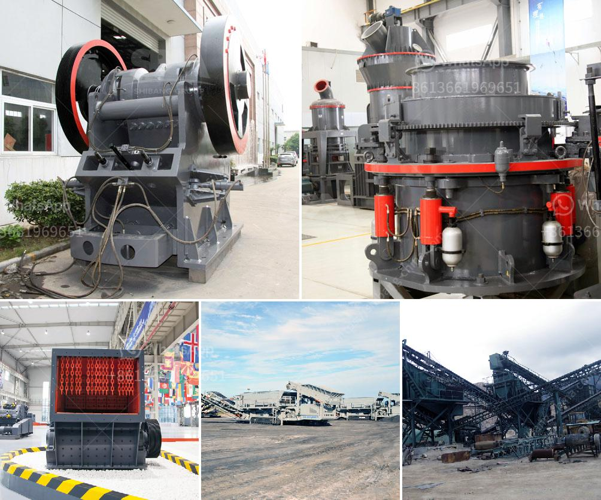

<h3>cost o gypsum processing machines</h3>
Gypsum, a mineral widely used in various industries, is a critical component in the production of building materials and additives. To extract and process gypsum efficiently, specialized equipment is required to crush, grind, and prepare the mineral for use. In this article, we will explore the cost of gypsum processing machines and their importance in the production process.

Gypsum processing machines play a vital role in the gypsum manufacturing process. The primary task of these machines is to reduce the large chunks of raw gypsum into smaller particles that can be further processed into different products, such as plasterboard, gypsum powder, and gypsum blocks.

One of the essential machines in the gypsum processing line is the crusher. It breaks down the large-sized gypsum ore into smaller pieces, making it suitable for further processing. The cost of a crusher varies depending on its capacity, model, and specifications. Generally, jaw crushers are more commonly used for primary crushing, while impact crushers or cone crushers are utilized in secondary or tertiary crushing.

After crushing, gypsum particles need to be ground into a fine powder through a grinding mill. There are various types of mills available for grinding gypsum, including ball mills, Raymond mills, high-pressure grinding mills, and vertical roller mills. The cost of a grinding mill depends on its capacity, speed, and capabilities. Each mill has its advantages and features, and the selection depends on specific requirements and the desired final product.

In addition to crushers and grinding mills, other machines are necessary for the gypsum processing line. These include vibrating feeders, conveyors, vibrating screens, and dust collectors. These machines are designed to facilitate the transportation, screening, and collection of gypsum particles during the production process.

The cost of gypsum processing machines can vary significantly depending on factors such as the desired production capacity, the level of automation, and the quality of the equipment. Generally, higher-capacity machines are more expensive than lower-capacity ones. Additionally, advanced technologies, such as PLC systems and advanced control panels, can increase the cost of the machines.

In recent years, manufacturers have introduced innovative solutions to reduce the cost and improve the efficiency of gypsum processing machines. These advancements include more energy-efficient motors and the use of advanced materials to increase durability and reduce maintenance requirements. Manufacturers have also focused on automating processes to minimize human intervention and increase productivity.

When considering the cost of gypsum processing machines, it is important to evaluate not only their initial purchase price but also factors such as long-term operational costs, maintenance needs, and the availability of spare parts. Investing in high-quality machines from reputable manufacturers may initially incur a higher cost but can result in better performance, increased productivity, and reduced downtime in the long run.

In conclusion, gypsum processing machines are essential for efficiently extracting, crushing, grinding, and preparing gypsum for use in various industries. The cost of these machines varies based on their capacity, specifications, and features. It is crucial to evaluate factors beyond the initial purchase price to ensure long-term cost-effectiveness and productivity. By investing in high-quality machines, businesses can maximize the value and benefits of gypsum processing in their operations.
<h3>Contact us</h3><ul><li><strong>Whatsapp:&nbsp;<a href="https://wa.me/8613661969651">+8613661969651</a></strong></li><li><a href="https://swt.shibang-china.com/?git&amp;zhl&amp;cost o gypsum processing machines"><strong>Online Service(chat now)</strong></a></li></ul><h3>Related</h3><ul><li><a href='china grove roller mill.md'>china grove roller mill</a></li><li><a href='cost of quarry crusher machines.md'>cost of quarry crusher machines</a></li><li><a href='price of plant crusher in nigeria.md'>price of plant crusher in nigeria</a></li><li><a href='4 roller mill for stone.md'>4 roller mill for stone</a></li><li><a href='cement processing plant.md'>cement processing plant</a></li></ul>