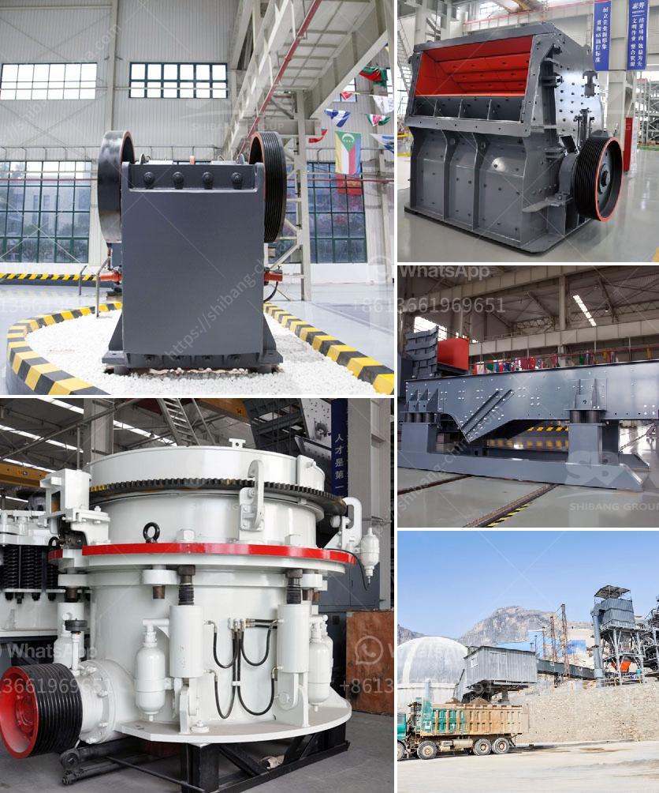

<h3>cost of barite in the nigeria market</h3>
Barite, a mineral resource abundant in Nigeria, is a key ingredient in the production of drilling fluids for the oil and gas industry. Due to its high specific gravity and excellent drilling properties, barite is used as a weighing agent during drilling operations to control formation pressures and prevent blowouts. As Nigeria is a major player in the oil and gas sector, the cost of barite in the Nigerian market is of great importance to both local and international industry stakeholders.

The cost of barite in the Nigerian market is influenced by several factors, including production, demand, and transportation. Nigeria is blessed with ample barite reserves, making it a significant global producer and exporter. Despite its vast reserves, the local production of barite falls short of meeting the demand from the oil and gas sector, resulting in a reliance on imports.

The cost of barite is determined by the mining and processing methods employed by local producers. Generally, barite is extracted through open-pit mining, which involves removing overburden (soil and rock) to access the barite vein. The extracted ore is then crushed, ground, and classified into various particle sizes. This process requires heavy machinery and consumes a considerable amount of energy, contributing to the overall cost of barite production.

In addition to production costs, the demand for barite in the Nigerian market strongly influences its price. The oil and gas industry is the main consumer of barite, utilizing it as a weighting agent in drilling fluids. The level of drilling activity in Nigeria, as well as global oil prices, can significantly impact demand and, consequently, the cost of barite. When drilling activity is low, demand decreases, leading to a potential drop in price. Conversely, when drilling activity rises, the demand for barite increases, potentially driving up its cost.

Transportation costs also play a crucial role in determining the cost of barite in the Nigerian market. Barite is primarily transported as crushed ore or as a finished product after processing. Since Nigeria primarily exports barite, transportation expenses can be substantial, depending on the distance to the destination market. The cost of logistics, such as shipping and handling, can significantly add to the overall price of imported barite.

Challenges faced by the Nigerian barite industry also impact its cost in the local market. These challenges include inadequate infrastructure, regulatory issues, and the prevalence of artisanal mining practices. Inadequate infrastructure, such as poor road networks and limited storage facilities, increases transportation costs and hampers the efficient supply of barite. Regulatory issues, such as licensing and environmental regulations, can also add to the overall cost of doing business in the barite industry.

In conclusion, the cost of barite in the Nigerian market is affected by various factors, including production, demand, transportation, and industry challenges. Barite is a critical component in the oil and gas industry, and its cost has implications for both local operators and international companies operating in Nigeria. To ensure a stable supply and competitive prices, efforts should be made to address the challenges facing the Nigerian barite industry, promote local production, and improve overall infrastructure and regulatory frameworks.
<h3>Contact us</h3><ul><li><strong>Whatsapp:&nbsp;<a href="https://wa.me/8613661969651">+8613661969651</a></strong></li><li><a href="https://swt.shibang-china.com/?git&amp;zhl&amp;cost of barite in the nigeria market"><strong>Online Service(chat now)</strong></a></li></ul><h3>Related</h3><ul><li><a href='crushing and screening plant for sale.md'>crushing and screening plant for sale</a></li><li><a href='rock crushing plants in tanzania.md'>rock crushing plants in tanzania</a></li><li><a href='komatsu crusher for sale in malaysia.md'>komatsu crusher for sale in malaysia</a></li><li><a href='ballast crusher machine prices in kenya.md'>ballast crusher machine prices in kenya</a></li><li><a href='lm series vertical mill.md'>lm series vertical mill</a></li></ul>