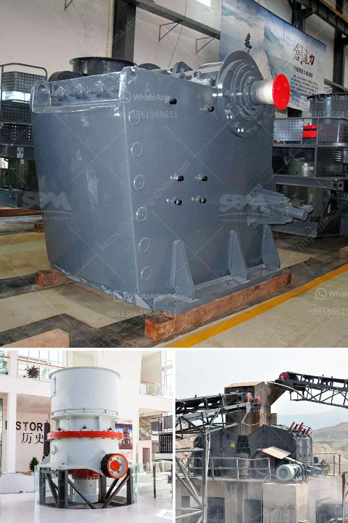

<h3>cost of cement factory setup</h3>
Setting up a cement factory can be a lucrative and profitable venture. However, it comes with its challenges and costs. It's essential to understand the factors that determine the cost of establishing a cement factory and plan carefully to avoid any unexpected expenses.

One of the primary costs associated with setting up a cement factory is land acquisition. Cement plants require a vast area of land to accommodate various facilities and machinery. The size of the land will depend on the scale of the factory. Larger plants may require several acres of land, while smaller plants can operate on a smaller plot. The location of the factory is also crucial, as it determines transportation costs and access to raw materials.

The cost of machinery and equipment is another significant expense. Cement factories require a range of equipment, including crushers, grinders, kilns, conveyors, and packing machines. These machines can be expensive, especially if you opt for high-quality, efficient equipment. It's vital to invest in reliable machinery to ensure the smooth operation of the factory and minimize maintenance costs in the long run.

In addition to machinery, energy costs are a significant consideration. Cement production is an energy-intensive process, requiring substantial amounts of electricity and fuel. Electricity powers machinery and lighting, while fuel is used in kilns to heat raw materials and produce cement clinker. To minimize energy costs, it's essential to invest in energy-efficient equipment and explore renewable energy sources, such as solar power.

Labor costs also contribute to the overall setup expenses. Running a cement factory requires a skilled workforce, including engineers, technicians, machine operators, and maintenance personnel. Salaries and benefits for these employees can constitute a significant portion of the budget. It's crucial to hire experienced personnel who can ensure efficient and safe operation of the factory.

Permits, licenses, and regulatory compliance are additional costs to consider. Obtaining the necessary permits and licenses to set up a cement factory can be a lengthy and bureaucratic process. Consulting with local authorities, understanding the legal requirements, and hiring experts to handle the paperwork can help streamline the process but may come with a financial cost.

Transportation costs are yet another expenditure to factor in. Cement factories need a consistent supply of raw materials, such as limestone, clay, iron ore, and gypsum. These materials may have to be transported from mining sites to the factory, which can increase costs. Additionally, cement products need to be shipped to distributors or customers, which can also add to transportation expenses. Selecting a location that minimizes these costs and ensures efficient logistics is crucial.

Other expenses to consider include infrastructure development, such as roads and utilities, environmental considerations, such as waste management systems and pollution control measures, and insurance coverage for the factory and employees.

In conclusion, setting up a cement factory involves several costs that need careful consideration. Land acquisition, machinery and equipment, energy costs, labor expenses, permits, licenses, transportation, and other associated costs should all be factored into the budget. A well-planned and executed setup can ensure the profitability and success of the cement factory in the long run.
<h3>Contact us</h3><ul><li><strong>Whatsapp:&nbsp;<a href="https://wa.me/8613661969651">+8613661969651</a></strong></li><li><a href="https://swt.shibang-china.com/?git&amp;zhl&amp;cost of cement factory setup"><strong>Online Service(chat now)</strong></a></li></ul><h3>Related</h3><ul><li><a href='ballast crushing equipment.md'>ballast crushing equipment</a></li><li><a href='how to calcium plant manufacturer.md'>how to calcium plant manufacturer</a></li><li><a href='how to start gold mining in ghana.md'>how to start gold mining in ghana</a></li><li><a href='business plan of silica sand crusher factory.md'>business plan of silica sand crusher factory</a></li><li><a href='micro powder mill cost.md'>micro powder mill cost</a></li></ul>