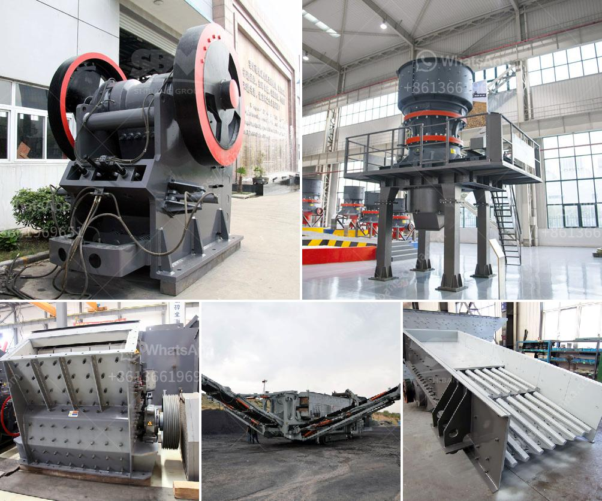

<h3>cost of clinker grinding and cemen packing plant</h3>
The cost of clinker grinding and cement packing plant is the initial investment required for setting up a new cement production line. It is important to note that the cost in question includes the equipment, raw material, and infrastructure expenses incurred in the installation of the plant.

Clinker grinding refers to the process of grinding clinker, the raw material used to produce cement, into a fine powder. This powder, known as cement, is then packed into bags for distribution and sale. Clinker grinding is an essential step in cement production, as it is responsible for the quality and density of the final product.

The cost of clinker grinding and cement packing plant varies depending on the capacity of the plant. Typically, a smaller plant with a capacity of 500 tons per day will require a lower investment compared to a larger plant with a capacity of 3000 tons per day. The cost also depends on the location of the plant, availability of raw materials, and labor costs in the region.

The major cost components involved in setting up a clinker grinding and cement packing plant include:

1. Machinery and Equipment: This includes the cost of purchasing and installing grinding mills, crushers, conveyors, dust collectors, and packing machines. High-quality equipment is essential for efficient and continuous operation of the plant.

2. Infrastructure: The cost of setting up the infrastructure required for the plant, such as construction of buildings, warehouses, and storage facilities, should be taken into account.

3. Raw Material Costs: The cost of procuring clinker, gypsum, and other additives required for cement production should be considered. The availability of these raw materials in the region can affect the overall cost.

4. Labor Costs: The cost of hiring skilled and unskilled labor required for operating the plant and carrying out maintenance activities should be factored into the budget.

5. Electrical and Fuel Costs: The cost of electricity and fuel required for operating various machinery and equipment in the plant should be included in the overall cost estimation.

Overall, the cost of setting up a clinker grinding and cement packing plant can range from a few million to several million dollars, depending on the capacity and location of the plant. It is crucial to conduct a thorough feasibility study and cost analysis before proceeding with the project.

In conclusion, the cost of clinker grinding and cement packing plant involves various factors such as machinery and equipment, infrastructure, raw material costs, labor costs, and electricity and fuel expenses. A detailed analysis of these costs is necessary to determine the total investment required for setting up a new cement production line.
<h3>Contact us</h3><ul><li><strong>Whatsapp:&nbsp;<a href="https://wa.me/8613661969651">+8613661969651</a></strong></li><li><a href="https://swt.shibang-china.com/?git&amp;zhl&amp;cost of clinker grinding and cemen packing plant"><strong>Online Service(chat now)</strong></a></li></ul><h3>Related</h3><ul><li><a href='cost of setting up a quarry crusher in nigeria.md'>cost of setting up a quarry crusher in nigeria</a></li><li><a href='stone cutting machine in india.md'>stone cutting machine in india</a></li><li><a href='used stone crusher nigeria.md'>used stone crusher nigeria</a></li><li><a href='barite crusher machinery.md'>barite crusher machinery</a></li><li><a href='crushers of cone ethiopia.md'>crushers of cone ethiopia</a></li></ul>