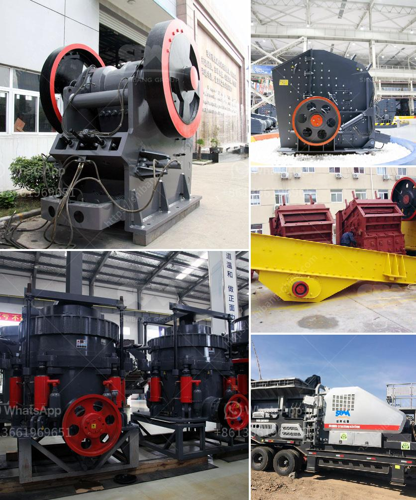

<h3>cost of crushing plants in india</h3>
The construction industry in India is booming. With the increasing demand for residential and commercial infrastructure, the need for crushed stones and other raw materials used in construction has also skyrocketed. This has resulted in a surge in the establishment of crushing plants all across the country.

A crushing plant is a facility that breaks down large chunks of rock, debris, and concrete into smaller pieces suitable for further processing. Crushing plants use different mechanisms, such as jaw crushers, impact crushers, and cone crushers, to reduce the size of raw materials and produce aggregates that are used in construction.

The cost of setting up a crushing plant in India varies depending on the size of the plant, the capacity, and the specific requirements of the project. As a general rule of thumb, it is always beneficial to have a high-capacity crushing plant that can process the raw materials efficiently and economically.

The cost of a crushing plant primarily includes two elements: capital investment and operational costs.

Capital investment refers to the cost of acquiring the necessary machinery, equipment, and infrastructure needed for setting up the crushing plant. This can vary greatly depending on the size and capacity of the plant. For instance, a small-scale crushing plant with a capacity of 30-40 tons per hour might require a capital investment of around $500,000, while a large-scale plant with a capacity of 300-500 tons per hour might require an investment of around $5 million.

Operational costs, on the other hand, include expenses related to labor, electricity, maintenance, and fuel. These costs are ongoing and need to be factored in the overall budget for running the crushing plant. Labor costs can vary depending on the scale of operations and the number of workers required. Electricity costs can also vary depending on the power consumption of the plant. Maintenance costs include regular servicing and repairs of machinery and equipment. Fuel costs depend on the energy source used to power the plant, be it electricity or diesel.

It is crucial to consider both capital investment and operational costs when estimating the total cost of setting up and running a crushing plant. While the initial capital investment might seem daunting, it is important to weigh it against the long-term benefits. A high-capacity crushing plant can significantly increase the production output and quality of aggregates, leading to higher profits in the long run.

Moreover, the cost of raw materials, such as stones and aggregates, should also be considered. The availability and cost of raw materials can vary depending on the region. Some regions might have an abundance of raw materials, while others might face scarcity, leading to higher prices. It is important to factor in the transportation costs for procuring raw materials when estimating the total cost of a crushing plant.

In conclusion, the cost of setting up and running a crushing plant in India can vary depending on various factors such as the size, capacity, and specific requirements of the project. It is crucial to carefully assess the capital investment and operational costs to ensure a cost-effective and efficient operation. The booming construction industry in India provides ample opportunities for crushing plant owners and investors to capitalize on the growing demand for aggregates.
<h3>Contact us</h3><ul><li><strong>Whatsapp:&nbsp;<a href="https://wa.me/8613661969651">+8613661969651</a></strong></li><li><a href="https://swt.shibang-china.com/?git&amp;zhl&amp;cost of crushing plants in india"><strong>Online Service(chat now)</strong></a></li></ul><h3>Related</h3><ul><li><a href='dust pollution control machine for stone crusher.md'>dust pollution control machine for stone crusher</a></li><li><a href='kaolin mining india.md'>kaolin mining india</a></li><li><a href='vertical mill for.md'>vertical mill for</a></li><li><a href='tertiary impact crushers for quartz.md'>tertiary impact crushers for quartz</a></li><li><a href='stone crusher for road construction.md'>stone crusher for road construction</a></li></ul>